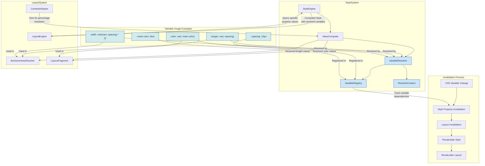

```mermaid
flowchart TD
    %% Style Computation Main Components
    subgraph StyleSystem[StyleSystem]
        SCE[StyleEngine]
        VC[ValueComputer]
        VR[VariableResolver]:::new
        VReg[VariableRegistry]:::new
        RC[ResolverContext]:::new
    end
    
    %% Layout Engine Main Components
    subgraph LayoutSystem[LayoutSystem]
        LE[LayoutEngine]
        CS[ConstraintSpace]
        BGR[BoxGeometryResolver]
        LF[LayoutFragment]
    end
    
    %% Data Flow - Variables to Layout
    SCE --> VC
    VC --> VR
    VR --> VReg
    VR --> RC
    
    %% Style and Layout Integration
    SCE -- "Computed Style\nwith resolved variables" --> LE
    LE -- "Query specific\nproperty values" --> SCE
    
    %% Variable Usage in Layout
    VC -- "Resolved length values" --> BGR
    VC -- "Resolved color values" --> LF
    CS -- "Size for percentage\nresolution" --> VC
    
    %% Variable Invalidation Flow
    subgraph Invalidation[Invalidation Process]
        VarChange[CSS Variable Change]
        PropInval[Style Property Invalidation]
        LayoutInval[Layout Invalidation]
        RecalcStyle[Recalculate Style]
        RecalcLayout[Recalculate Layout]
    end
    
    VarChange --> PropInval
    PropInval --> LayoutInval
    LayoutInval --> RecalcStyle
    RecalcStyle --> RecalcLayout
    VReg -- "Track variable\ndependencies" --> PropInval
    
    %% Add detailed calculation examples
    subgraph VariableExamples[Variable Usage Examples]
        VarEx1["--spacing: 10px"]
        VarEx2["--main-color: blue"]
        VarEx3["margin: var(--spacing)"]
        VarEx4["width: calc(var(--spacing) * 2)"]
        VarEx5["color: var(--main-color)"]
    end
    
    VarEx1 -- "Registered in" --> VReg
    VarEx2 -- "Registered in" --> VReg
    VarEx3 -- "Resolved by" --> VR
    VarEx4 -- "Resolved by" --> VR
    VarEx5 -- "Resolved by" --> VR
    VarEx3 -- "Used in" --> BGR
    VarEx4 -- "Used in" --> BGR
    VarEx5 -- "Used in" --> LF
    
    classDef new fill:#cce5ff,stroke:#004085
    classDef example fill:#d1ecf1,stroke:#0c5460
    
    class VarEx1,VarEx2,VarEx3,VarEx4,VarEx5 example
```