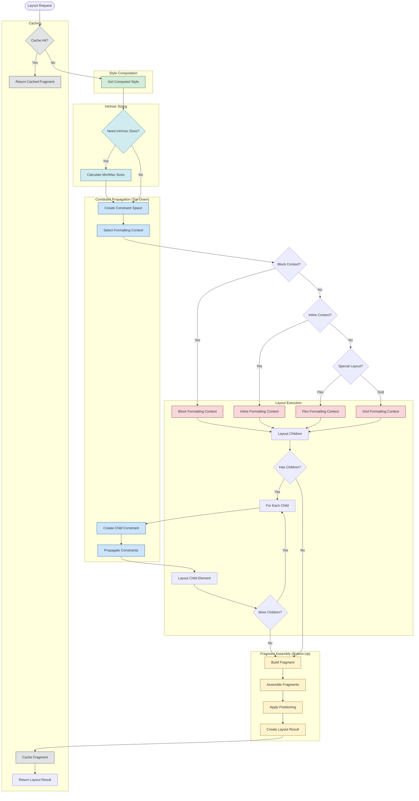

```mermaid
flowchart TD
    %% Entry Point
    Start([Layout Request]) --> CacheCheck{Cache Hit?}
    
    %% Cache Flow
    CacheCheck -- Yes --> ReturnCached[Return Cached Fragment]
    CacheCheck -- No --> StyleCheck[Get Computed Style]
    
    %% Phase 1: Constraint and Initial Setup
    StyleCheck --> SizeCheck{Need Intrinsic Sizes?}
    SizeCheck -- Yes --> CalcSizes[Calculate Min/Max Sizes]
    SizeCheck -- No --> CreateConstraint
    CalcSizes --> CreateConstraint[Create Constraint Space]
    
    %% Phase 2: Formatting Context Selection
    CreateConstraint --> SelectContext[Select Formatting Context]
    SelectContext --> IsBlock{Block Context?}
    IsBlock -- Yes --> BlockLayout[Block Formatting Context]
    IsBlock -- No --> IsInline{Inline Context?}
    IsInline -- Yes --> InlineLayout[Inline Formatting Context]
    IsInline -- No --> IsSpecial{Special Layout?}
    IsSpecial -- Flex --> FlexLayout[Flex Formatting Context]
    IsSpecial -- Grid --> GridLayout[Grid Formatting Context]
    
    %% Phase 3: Layout Algorithm Execution
    BlockLayout --> ChildLayout[Layout Children]
    InlineLayout --> ChildLayout
    FlexLayout --> ChildLayout
    GridLayout --> ChildLayout
    
    %% Recursive Child Layout
    ChildLayout --> HasChildren{Has Children?}
    HasChildren -- Yes --> LoopChildren[For Each Child]
    HasChildren -- No --> BuildFragment
    
    %% Child Loop
    LoopChildren --> ChildConstraint[Create Child Constraint]
    ChildConstraint --> ConstraintPropagation[Propagate Constraints]
    ConstraintPropagation --> RecursiveLayout[Layout Child Element]
    RecursiveLayout --> MoreChildren{More Children?}
    MoreChildren -- Yes --> LoopChildren
    MoreChildren -- No --> BuildFragment
    
    %% Phase 4: Fragment Assembly
    BuildFragment[Build Fragment] --> AssembleFragments[Assemble Fragments]
    AssembleFragments --> ApplyPositioning[Apply Positioning]
    ApplyPositioning --> FinalizeLayout[Create Layout Result]
    
    %% Phase 5: Caching and Return
    FinalizeLayout --> CacheResult[Cache Fragment]
    CacheResult --> ReturnResult[Return Layout Result]
    
    %% Styling
    subgraph "Style Computation"
        StyleCheck
    end
    
    %% Constraint Propagation Phase
    subgraph "Constraint Propagation (Top-Down)"
        CreateConstraint
        SelectContext
        ChildConstraint
        ConstraintPropagation
    end
    
    %% Layout Algorithm Phase
    subgraph "Layout Execution"
        BlockLayout
        InlineLayout
        FlexLayout
        GridLayout
        ChildLayout
        HasChildren
        LoopChildren
        RecursiveLayout
        MoreChildren
    end
    
    %% Fragment Assembly Phase
    subgraph "Fragment Assembly (Bottom-Up)"
        BuildFragment
        AssembleFragments
        ApplyPositioning
        FinalizeLayout
    end
    
    %% Caching Phase
    subgraph "Caching"
        CacheCheck
        ReturnCached
        CacheResult
        ReturnResult
    end
    
    %% Intrinsic Sizing Phase
    subgraph "Intrinsic Sizing"
        SizeCheck
        CalcSizes
    end
    
    %% Style Color
    style StyleCheck fill:#d4edda,stroke:#155724
    
    %% Constraint Color
    style CreateConstraint fill:#cce5ff,stroke:#004085
    style SelectContext fill:#cce5ff,stroke:#004085
    style ChildConstraint fill:#cce5ff,stroke:#004085
    style ConstraintPropagation fill:#cce5ff,stroke:#004085
    
    %% Layout Color
    style BlockLayout fill:#f8d7da,stroke:#721c24
    style InlineLayout fill:#f8d7da,stroke:#721c24
    style FlexLayout fill:#f8d7da,stroke:#721c24
    style GridLayout fill:#f8d7da,stroke:#721c24
    
    %% Fragment Color
    style BuildFragment fill:#fff3cd,stroke:#856404
    style AssembleFragments fill:#fff3cd,stroke:#856404
    style ApplyPositioning fill:#fff3cd,stroke:#856404
    style FinalizeLayout fill:#fff3cd,stroke:#856404
    
    %% Cache Color
    style CacheCheck fill:#e2e3e5,stroke:#383d41
    style ReturnCached fill:#e2e3e5,stroke:#383d41
    style CacheResult fill:#e2e3e5,stroke:#383d41
    
    %% Sizing Color
    style SizeCheck fill:#d1ecf1,stroke:#0c5460
    style CalcSizes fill:#d1ecf1,stroke:#0c5460
```