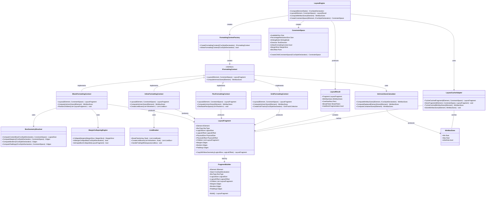

```mermaid
classDiagram
    %% Main Layout Engine Class
    class LayoutEngine {
        +ComputeElementStyle() ICssStyleDeclaration
        +Layout(IElement, ConstraintSpace) LayoutResult
        +ComputeMinMaxSizes(IElement) MinMaxSizes
        +CreateConstraintSpace(IElement, ICssStyleDeclaration) ConstraintSpace
    }
    
    %% Formatting Context Factory
    class FormattingContextFactory {
        +CreateFormattingContext(ICssStyleDeclaration) IFormattingContext
        +IsNewFormattingContext(ICssStyleDeclaration) bool
    }
    
    %% Constraint Space
    class ConstraintSpace {
        +AvailableSize Size
        +PercentageResolutionSize Size
        +WritingMode WritingMode
        +Direction TextDirection
        +IsNewFormattingContext bool
        +MarginStrut MarginStrut
        +BfcOffset Point
        +CreateChildConstraintSpace(ICssStyleDeclaration) ConstraintSpace
    }
    
    %% Formatting Context Interface
    class IFormattingContext {
        <<interface>>
        +Layout(IElement, ConstraintSpace) LayoutFragment
        +ComputeIntrinsicSizes(IElement) MinMaxSizes
    }
    
    %% Specialized Formatting Contexts
    class BlockFormattingContext {
        +Layout(IElement, ConstraintSpace) LayoutFragment
        +ComputeIntrinsicSizes(IElement) MinMaxSizes
        +PositionChildren(List~LayoutFragment~) void
    }
    
    class InlineFormattingContext {
        +Layout(IElement, ConstraintSpace) LayoutFragment
        +ComputeIntrinsicSizes(IElement) MinMaxSizes
        +CreateLineBoxes(List~InlineItem~) List~LineBox~
    }
    
    class FlexFormattingContext {
        +Layout(IElement, ConstraintSpace) LayoutFragment
        +ComputeIntrinsicSizes(IElement) MinMaxSizes
        +DistributeFlexSpace(List~FlexItem~) void
    }
    
    class GridFormattingContext {
        +Layout(IElement, ConstraintSpace) LayoutFragment
        +ComputeIntrinsicSizes(IElement) MinMaxSizes
        +CreateGridTracks(ICssStyleDeclaration) GridTrackCollection
    }
    
    %% Helper Components
    class BoxGeometryResolver {
        +ComputeContentBox(ICssStyleDeclaration, ConstraintSpace) LogicalSize
        +ComputeMargins(ICssStyleDeclaration, ConstraintSpace) Edges
        +ComputeBorders(ICssStyleDeclaration) Edges
        +ComputePaddings(ICssStyleDeclaration, ConstraintSpace) Edges
    }
    
    class MarginCollapsingEngine {
        +CollapseMargins(MarginStrut, MarginStrut) MarginStrut
        +IsMarginCollapsible(ICssStyleDeclaration) bool
        +IsEmptyBlockCollapsible(LayoutFragment) bool
    }
    
    class IntrinsicSizesCalculator {
        +ComputeMinMaxSizes(IElement, ICssStyleDeclaration) MinMaxSizes
        +ComputeReplacedElementSizes(IElement) MinMaxSizes
        +ComputeContainerSizes(IElement) MinMaxSizes
    }
    
    class LineBreaker {
        +BreakText(string, float) List~LineBreak~
        +CreateLineBoxes(List~InlineItem~, float) List~LineBox~
        +HandleTrailingWhitespace(LineBox) void
    }
    
    %% Data Structures
    class LayoutFragment {
        +Element IElement
        +BoxType BoxType
        +LogicalSize LogicalSize
        +LogicalOffset LogicalOffset
        +PhysicalSize PhysicalSize
        +PhysicalOffset PhysicalOffset
        +Children List~LayoutFragment~
        +Margins Edges
        +Borders Edges
        +Paddings Edges
        +CopyWithNewGeometry(LogicalSize, LogicalOffset) LayoutFragment
    }
    
    class FragmentBuilder {
        +Element IElement
        +Style ICssStyleDeclaration
        +BoxType BoxType
        +LogicalSize LogicalSize
        +LogicalOffset LogicalOffset
        +Children List~LayoutFragment~
        +Margins Edges
        +Borders Edges
        +Paddings Edges
        +Build() LayoutFragment
    }
    
    class MinMaxSizes {
        +Min float
        +Max float
        +IsDefinite bool
    }
    
    class LayoutResult {
        +Fragment LayoutFragment
        +MinMaxSizes MinMaxSizes
        +OverflowRect Rect
        +BreakToken BreakToken
        +HasBlockFragmentation bool
    }
    
    %% Cache Integration
    class LayoutCacheAdapter {
        +TryGetCachedFragment(IElement, ConstraintSpace) LayoutFragment
        +StoreFragment(IElement, ConstraintSpace, LayoutFragment) void
        +TryGetCachedMinMaxSizes(IElement) MinMaxSizes
        +StoreMinMaxSizes(IElement, MinMaxSizes) void
    }
    
    %% Relationships
    LayoutEngine --> FormattingContextFactory : creates
    LayoutEngine --> ConstraintSpace : creates
    LayoutEngine --> LayoutCacheAdapter : uses
    LayoutEngine --> LayoutResult : produces
    
    FormattingContextFactory --> IFormattingContext : creates
    IFormattingContext <|-- BlockFormattingContext : implements
    IFormattingContext <|-- InlineFormattingContext : implements
    IFormattingContext <|-- FlexFormattingContext : implements
    IFormattingContext <|-- GridFormattingContext : implements
    
    BlockFormattingContext --> BoxGeometryResolver : uses
    BlockFormattingContext --> MarginCollapsingEngine : uses
    InlineFormattingContext --> LineBreaker : uses
    
    BlockFormattingContext --> LayoutFragment : produces
    InlineFormattingContext --> LayoutFragment : produces
    FlexFormattingContext --> LayoutFragment : produces
    GridFormattingContext --> LayoutFragment : produces
    
    LayoutFragment --> FragmentBuilder : built by
    LayoutResult --> LayoutFragment : contains
    
    IntrinsicSizesCalculator --> MinMaxSizes : produces
    IFormattingContext --> IntrinsicSizesCalculator : uses
    
    LayoutCacheAdapter -- LayoutFragment : caches
    LayoutCacheAdapter -- MinMaxSizes : caches
```