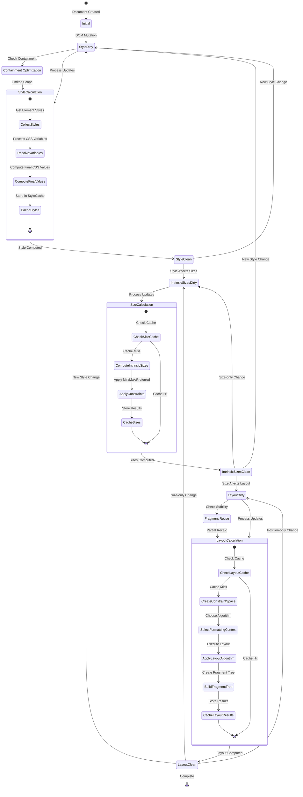

```mermaid
stateDiagram-v2
    [*] --> Initial: Document Created
    
    Initial --> StyleDirty: DOM Mutation
    
    StyleDirty --> StyleCalculation: Process Updates
    StyleCalculation --> StyleClean: Style Computed
    
    StyleClean --> IntrinsicSizesDirty: Style Affects Sizes
    
    IntrinsicSizesDirty --> SizeCalculation: Process Updates
    SizeCalculation --> IntrinsicSizesClean: Sizes Computed
    
    IntrinsicSizesClean --> LayoutDirty: Size Affects Layout
    
    LayoutDirty --> LayoutCalculation: Process Updates
    LayoutCalculation --> LayoutClean: Layout Computed
    
    LayoutClean --> [*]: Complete
    
    %% Interruptions/New Mutations
    StyleClean --> StyleDirty: New Style Change
    IntrinsicSizesClean --> StyleDirty: New Style Change
    LayoutClean --> StyleDirty: New Style Change
    
    IntrinsicSizesClean --> IntrinsicSizesDirty: Size-only Change
    LayoutClean --> IntrinsicSizesDirty: Size-only Change
    
    LayoutClean --> LayoutDirty: Position-only Change
    
    %% Detailed state descriptions
    state StyleCalculation {
        [*] --> CollectStyles: Get Element Styles
        CollectStyles --> ResolveVariables: Process CSS Variables
        ResolveVariables --> ComputeFinalValues: Compute Final CSS Values
        ComputeFinalValues --> CacheStyles: Store in StyleCache
        CacheStyles --> [*]
    }
    
    state SizeCalculation {
        [*] --> CheckSizeCache: Check Cache
        CheckSizeCache --> ComputeIntrinsicSizes: Cache Miss
        ComputeIntrinsicSizes --> ApplyConstraints: Apply Min/Max/Preferred
        ApplyConstraints --> CacheSizes: Store Results
        CacheSizes --> [*]
        CheckSizeCache --> [*]: Cache Hit
    }
    
    state LayoutCalculation {
        [*] --> CheckLayoutCache: Check Cache
        CheckLayoutCache --> CreateConstraintSpace: Cache Miss
        CreateConstraintSpace --> SelectFormattingContext: Choose Algorithm
        SelectFormattingContext --> ApplyLayoutAlgorithm: Execute Layout
        ApplyLayoutAlgorithm --> BuildFragmentTree: Create Fragment Tree
        BuildFragmentTree --> CacheLayoutResults: Store Results
        CacheLayoutResults --> [*]
        CheckLayoutCache --> [*]: Cache Hit
    }
    
    %% Optimization paths
    state "Containment Optimization" as ContainmentOpt
    StyleDirty --> ContainmentOpt: Check Containment
    ContainmentOpt --> StyleCalculation: Limited Scope
    
    state "Fragment Reuse" as FragmentReuse
    LayoutDirty --> FragmentReuse: Check Stability
    FragmentReuse --> LayoutCalculation: Partial Recalc
```