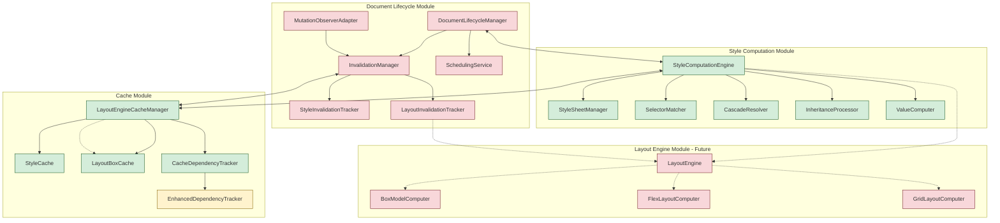

```mermaid
flowchart TB
    subgraph StyleComputation[Style Computation Module]
        SCE[StyleComputationEngine]
        SM[StyleSheetManager]
        SELM[SelectorMatcher]
        CR[CascadeResolver]
        IP[InheritanceProcessor]
        VC[ValueComputer]
    end
    
    subgraph DocumentLifecycle[Document Lifecycle Module]
        DLM[DocumentLifecycleManager]
        MOA[MutationObserverAdapter]
        IM[InvalidationManager]
        SIT[StyleInvalidationTracker]
        LIT[LayoutInvalidationTracker]
        SS[SchedulingService]
    end
    
    subgraph CacheModule[Cache Module]
        LECM[LayoutEngineCacheManager]
        SC[StyleCache]
        LBC[LayoutBoxCache]
        CDT[CacheDependencyTracker]
        EDT[EnhancedDependencyTracker]
    end
    
    subgraph LayoutEngine[Layout Engine Module - Future]
        LE[LayoutEngine]
        BMC[BoxModelComputer]
        FLC[FlexLayoutComputer]
        GLC[GridLayoutComputer]
    end
    
    SCE --> SM
    SCE --> SELM
    SCE --> CR
    SCE --> IP
    SCE --> VC
    
    DLM --> IM
    DLM --> SS
    MOA --> IM
    IM --> SIT
    IM --> LIT
    
    LECM --> SC
    LECM --> LBC
    LECM --> CDT
    CDT --> EDT
    
    SCE <--> LECM
    IM <--> LECM
    DLM <--> SCE
    
    SCE -.-> LE
    LIT -.-> LE
    LE -.-> BMC
    LE -.-> FLC
    LE -.-> GLC
    LECM -.-> LBC
    
    classDef implemented fill:#d4edda,stroke:#155724
    classDef partial fill:#fff3cd,stroke:#856404
    classDef future fill:#f8d7da,stroke:#721c24
    classDef core fill:#cce5ff,stroke:#004085
    
    class SCE,SM,SELM,CR,IP,VC,LECM,SC,LBC,CDT implemented
    class EDT partial
    class DLM,MOA,IM,SIT,LIT,SS future
    class LE,BMC,FLC,GLC future
```
