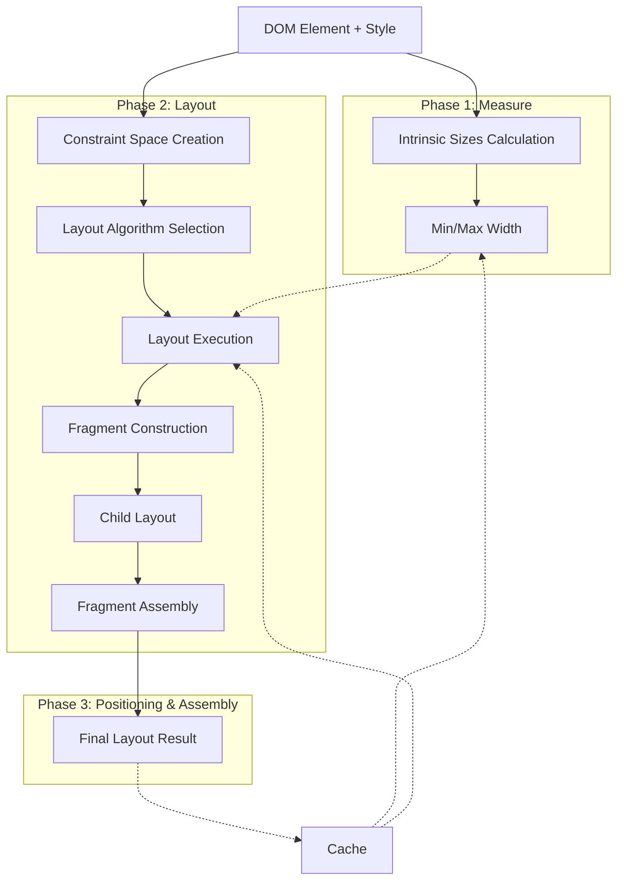

```mermaid
flowchart TD
    A[DOM Element + Style] --> B[Intrinsic Sizes Calculation]
    B --> C[Min/Max Width]
    
    A --> D[Constraint Space Creation]
    D --> E[Layout Algorithm Selection]
    E --> F[Layout Execution]
    
    C -.-> F
    
    F --> G[Fragment Construction]
    G --> H[Child Layout]
    H --> I[Fragment Assembly]
    I --> J[Final Layout Result]
    
    subgraph "Phase 1: Measure"
        B
        C
    end
    
    subgraph "Phase 2: Layout"
        D
        E
        F
        G
        H
        I
    end
    
    subgraph "Phase 3: Positioning & Assembly"
        J
    end
    
    K[Cache] -.-> C
    K -.-> F
    J -.-> K
```