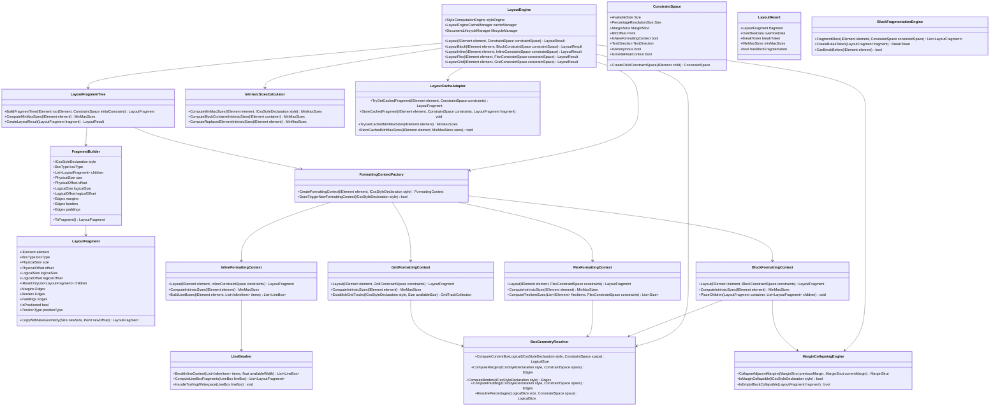

```mermaid
classDiagram
    class LayoutEngine {
        +StyleComputationEngine styleEngine
        +LayoutEngineCacheManager cacheManager
        +DocumentLifecycleManager lifecycleManager
        +Layout(IElement element, ConstraintSpace constraintSpace) LayoutResult
        +LayoutBlock(IElement element, BlockConstraintSpace constraintSpace) LayoutResult
        +LayoutInline(IElement element, InlineConstraintSpace constraintSpace) LayoutResult
        +LayoutFlex(IElement element, FlexConstraintSpace constraintSpace) LayoutResult
        +LayoutGrid(IElement element, GridConstraintSpace constraintSpace) LayoutResult
    }

    class LayoutFragmentTree {
        +BuildFragmentTree(IElement rootElement, ConstraintSpace initialConstraint) LayoutFragment
        +ComputeMinMaxSizes(IElement element) MinMaxSizes
        +CreateLayoutResult(LayoutFragment fragment) LayoutResult
    }

    class ConstraintSpace {
        +AvailableSize Size
        +PercentageResolutionSize Size
        +MarginStrut MarginStrut
        +BfcOffset Point
        +IsNewFormattingContext bool
        +TextDirection TextDirection
        +IsAnonymous bool
        +IsInsideFloatContext bool
        +CreateChildConstraintSpace(IElement child) ConstraintSpace
    }

    class LayoutFragment {
        +IElement element
        +BoxType boxType
        +PhysicalSize size
        +PhysicalOffset offset
        +LogicalSize logicalSize
        +LogicalOffset logicalOffset
        +IReadOnlyList~LayoutFragment~ children
        +Margins Edges
        +Borders Edges
        +Paddings Edges
        +IsPositioned bool
        +PositionType positionType
        +CopyWithNewGeometry(Size newSize, Point newOffset) LayoutFragment
    }

    class LayoutResult {
        +LayoutFragment fragment
        +OverflowData overflowData
        +BreakToken breakToken
        +MinMaxSizes minMaxSizes
        +bool hasBlockFragmentation
    }

    class BlockFragmentationEngine {
        +FragmentBlock(IElement element, ConstraintSpace constraintSpace) List~LayoutFragment~
        +CreateBreakToken(LayoutFragment fragment) BreakToken
        +CanBreakBefore(IElement element) bool
    }

    class FragmentBuilder {
        +ICssStyleDeclaration style
        +BoxType boxType
        +List~LayoutFragment~ children
        +PhysicalSize size
        +PhysicalOffset offset
        +LogicalSize logicalSize
        +LogicalOffset logicalOffset
        +Edges margins
        +Edges borders
        +Edges paddings
        +ToFragment() LayoutFragment
    }

    class BoxGeometryResolver {
        +ComputeContentBoxLogical(ICssStyleDeclaration style, ConstraintSpace space) LogicalSize
        +ComputeMargins(ICssStyleDeclaration style, ConstraintSpace space) Edges
        +ComputeBorders(ICssStyleDeclaration style) Edges
        +ComputePadding(ICssStyleDeclaration style, ConstraintSpace space) Edges
        +ResolvePercentages(LogicalSize size, ConstraintSpace space) LogicalSize
    }

    class FormattingContextFactory {
        +CreateFormattingContext(IElement element, ICssStyleDeclaration style) FormattingContext
        +DoesTriggerNewFormattingContext(ICssStyleDeclaration style) bool
    }

    class BlockFormattingContext {
        +Layout(IElement element, BlockConstraintSpace constraints) LayoutFragment
        +ComputeIntrinsicSizes(IElement element) MinMaxSizes
        +PlaceChildren(LayoutFragment container, List~LayoutFragment~ children) void
    }

    class InlineFormattingContext {
        +Layout(IElement element, InlineConstraintSpace constraints) LayoutFragment
        +ComputeIntrinsicSizes(IElement element) MinMaxSizes
        +BuildLineBoxes(IElement element, List~InlineItem~ items) List~LineBox~
    }

    class FlexFormattingContext {
        +Layout(IElement element, FlexConstraintSpace constraints) LayoutFragment
        +ComputeIntrinsicSizes(IElement element) MinMaxSizes
        +ComputeFlexItemSizes(List~IElement~ flexItems, FlexConstraintSpace constraints) List~Size~
    }

    class GridFormattingContext {
        +Layout(IElement element, GridConstraintSpace constraints) LayoutFragment
        +ComputeIntrinsicSizes(IElement element) MinMaxSizes
        +EstablishGridTracks(ICssStyleDeclaration style, Size availableSize) GridTrackCollection
    }

    class LineBreaker {
        +BreakInlineContent(List~InlineItem~ items, float availableWidth) List~LineBox~
        +ComputeLineBoxFragments(LineBox lineBox) List~LayoutFragment~
        +HandleTrailingWhitespace(LineBox lineBox) void
    }

    class MarginCollapsingEngine {
        +CollapseAdjacentMargins(MarginStrut previousMargin, MarginStrut currentMargin) MarginStrut
        +IsMarginCollapsible(ICssStyleDeclaration style) bool
        +IsEmptyBlockCollapsible(LayoutFragment fragment) bool
    }

    class IntrinsicSizesCalculator {
        +ComputeMinMaxSizes(IElement element, ICssStyleDeclaration style) MinMaxSizes
        +ComputeBlockContainerIntrinsicSizes(IElement container) MinMaxSizes
        +ComputeReplacedElementIntrinsicSizes(IElement element) MinMaxSizes
    }

    class LayoutCacheAdapter {
        +TryGetCachedFragment(IElement element, ConstraintSpace constraints) LayoutFragment
        +StoreCachedFragment(IElement element, ConstraintSpace constraints, LayoutFragment fragment) void
        +TryGetCachedMinMaxSizes(IElement element) MinMaxSizes
        +StoreCachedMinMaxSizes(IElement element, MinMaxSizes sizes) void
    }

    LayoutEngine --> LayoutFragmentTree
    LayoutEngine --> FormattingContextFactory
    LayoutEngine --> BoxGeometryResolver
    LayoutEngine --> LayoutCacheAdapter
    LayoutEngine --> MarginCollapsingEngine
    LayoutEngine --> IntrinsicSizesCalculator
    
    LayoutFragmentTree --> FragmentBuilder
    LayoutFragmentTree --> FormattingContextFactory
    
    FormattingContextFactory --> BlockFormattingContext
    FormattingContextFactory --> InlineFormattingContext 
    FormattingContextFactory --> FlexFormattingContext
    FormattingContextFactory --> GridFormattingContext
    
    BlockFormattingContext --> BoxGeometryResolver
    BlockFormattingContext --> MarginCollapsingEngine
    InlineFormattingContext --> LineBreaker
    FlexFormattingContext --> BoxGeometryResolver
    GridFormattingContext --> BoxGeometryResolver
    
    FragmentBuilder --> LayoutFragment
```