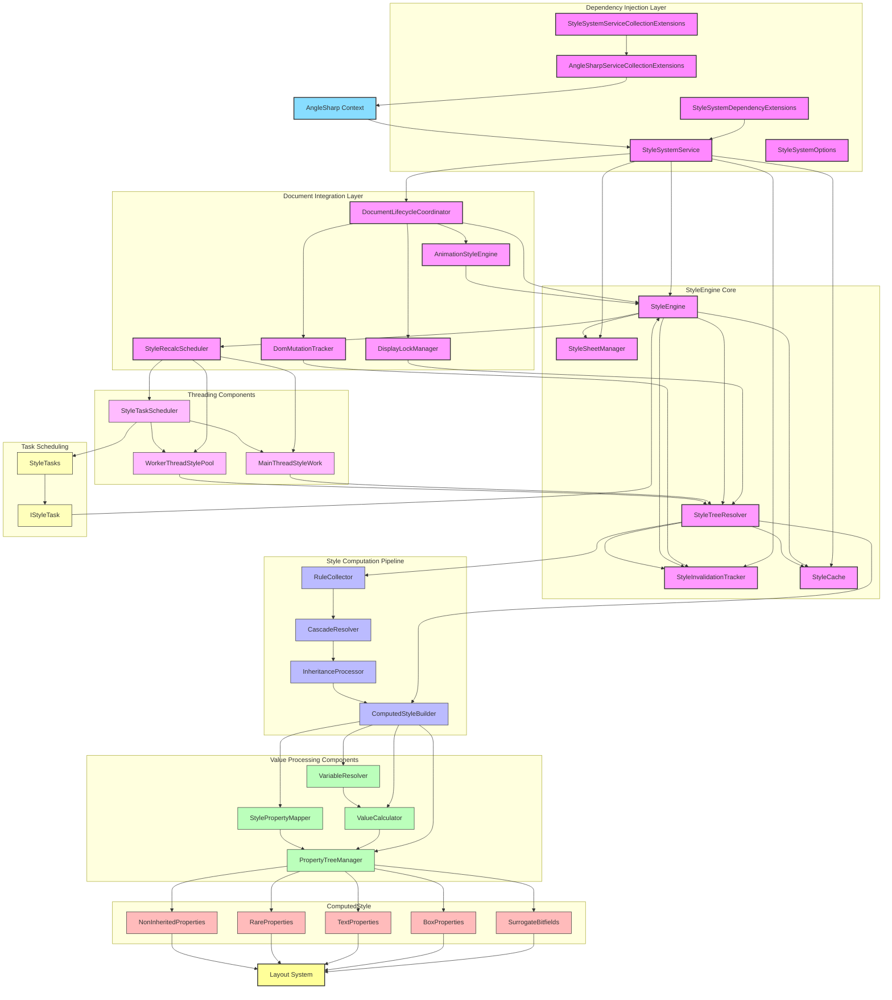

```mermaid
flowchart TB
    %% Dependency Injection Layer
    subgraph DILayer[Dependency Injection Layer]
        SSSE[StyleSystemServiceCollectionExtensions]
        ASSE[AngleSharpServiceCollectionExtensions]
        SDE[StyleSystemDependencyExtensions]
        SSS[StyleSystemService]
        SSO[StyleSystemOptions]
    end

    %% Document Integration Layer
    subgraph DocumentLayer[Document Integration Layer]
        DLC[DocumentLifecycleCoordinator]
        SRS[StyleRecalcScheduler]
        DLM[DisplayLockManager]
        ASE[AnimationStyleEngine]
        DMT[DomMutationTracker]
    end

    %% StyleEngine Core
    subgraph EngineCore[StyleEngine Core]
        SE[StyleEngine]
        STR[StyleTreeResolver]
        SIT[StyleInvalidationTracker]
        SC[StyleCache]
        SSM[StyleSheetManager]
    end
    
    %% Style Computation Pipeline
    subgraph ComputationPipeline[Style Computation Pipeline]
        RC[RuleCollector]
        CR[CascadeResolver]
        IP[InheritanceProcessor]
        CSB[ComputedStyleBuilder]
    end
    
    %% Value Processing Components
    subgraph ValueProcessing[Value Processing Components]
        VR[VariableResolver]
        VC[ValueCalculator]
        PTM[PropertyTreeManager]
        SPM[StylePropertyMapper]
    end
    
    %% Output Layer
    subgraph OutputLayer[ComputedStyle]
        SBF[SurrogateBitfields]
        BP[BoxProperties]
        TP[TextProperties]
        RP[RareProperties]
        NIP[NonInheritedProperties]
    end
    
    %% Threading Components
    subgraph ThreadingComponents[Threading Components]
        MTSW[MainThreadStyleWork]
        WTSP[WorkerThreadStylePool]
        STS[StyleTaskScheduler]
    end
    
    %% Task Scheduling
    subgraph TaskScheduling[Task Scheduling]
        STasks[StyleTasks]
        ISTasks[IStyleTask]
    end
    
    %% Layout System
    LS[Layout System]
    
    %% AngleSharp
    AS[AngleSharp Context]
    
    %% Connections between components
    
    %% Dependency Injection connections
    SSS --> SE
    SSS --> DLC
    SSS --> SSM
    SSS --> SC
    SSS --> SIT
    SDE --> SSS
    SSSE --> ASSE
    ASSE --> AS
    AS --> SSS
    
    %% Document Layer connections
    DLC --> SE
    DLC --> DLM
    DLC --> ASE
    DLC --> DMT
    DMT --> SIT
    
    %% Engine Core connections
    ASE --> SE
    SRS --> MTSW
    SRS --> WTSP
    SE --> SRS
    DLM --> STR
    SE --> STR
    SE --> SIT
    SE --> SSM
    SE --> SC
    
    %% Threading connections
    MTSW --> STR
    WTSP --> STR
    STS --> MTSW
    STS --> WTSP
    SRS --> STS
    
    %% Task connections
    STS --> STasks
    STasks --> ISTasks
    ISTasks --> SE
    
    %% Style computation connections
    STR --> RC
    STR --> SIT
    STR --> SC
    STR --> CSB
    
    RC --> CR
    CR --> IP
    IP --> CSB
    
    CSB --> VR
    CSB --> VC
    CSB --> PTM
    CSB --> SPM
    
    VR --> VC
    VC --> PTM
    SPM --> PTM
    
    PTM --> SBF
    PTM --> BP
    PTM --> TP
    PTM --> RP
    PTM --> NIP
    
    SBF --> LS
    BP --> LS
    TP --> LS
    RP --> LS
    NIP --> LS
    
    %% Style classes
    class DILayer,DocumentLayer,EngineCore,ComputationPipeline,ValueProcessing,OutputLayer,ThreadingComponents,TaskScheduling interface
    
    %% Component styling
    classDef di fill:#f8f,stroke:#333,stroke-width:2px
    classDef core fill:#f9f,stroke:#333,stroke-width:2px
    classDef compute fill:#bbf,stroke:#333,stroke-width:1px
    classDef value fill:#bfb,stroke:#333,stroke-width:1px
    classDef output fill:#fbb,stroke:#333,stroke-width:1px
    classDef thread fill:#fbf,stroke:#333,stroke-width:1px
    classDef task fill:#ffb,stroke:#333,stroke-width:1px
    classDef layout fill:#ff9,stroke:#333,stroke-width:2px
    classDef angleSharp fill:#8df,stroke:#333,stroke-width:2px
    
    class SSSE,ASSE,SDE,SSS,SSO di
    class SE,STR,SIT,SC,SSM core
    class RC,CR,IP,CSB compute
    class VR,VC,PTM,SPM value
    class SBF,BP,TP,RP,NIP output
    class MTSW,WTSP,STS thread
    class STasks,ISTasks task
    class LS layout
    class DLC,SRS,DLM,ASE,DMT core
    class AS angleSharp
```