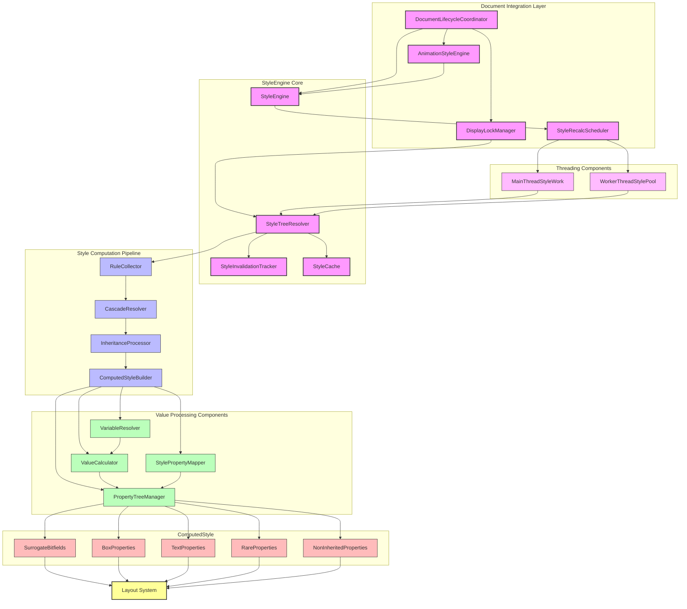

```mermaid
flowchart TB
    %% Document Integration Layer
    subgraph DocumentLayer[Document Integration Layer]
        DLC[DocumentLifecycleCoordinator]
        SRS[StyleRecalcScheduler]
        DLM[DisplayLockManager]
        ASE[AnimationStyleEngine]
    end

    %% StyleEngine Core
    subgraph EngineCore[StyleEngine Core]
        SE[StyleEngine]
        STR[StyleTreeResolver]
        SIT[StyleInvalidationTracker]
        SC[StyleCache]
    end
    
    %% Style Computation Pipeline
    subgraph ComputationPipeline[Style Computation Pipeline]
        RC[RuleCollector]
        CR[CascadeResolver]
        IP[InheritanceProcessor]
        CSB[ComputedStyleBuilder]
    end
    
    %% Value Processing Components
    subgraph ValueProcessing[Value Processing Components]
        VR[VariableResolver]
        VC[ValueCalculator]
        PTM[PropertyTreeManager]
        SPM[StylePropertyMapper]
    end
    
    %% Output Layer
    subgraph OutputLayer[ComputedStyle]
        SBF[SurrogateBitfields]
        BP[BoxProperties]
        TP[TextProperties]
        RP[RareProperties]
        NIP[NonInheritedProperties]
    end
    
    %% Threading Components
    subgraph ThreadingComponents[Threading Components]
        MTSW[MainThreadStyleWork]
        WTSP[WorkerThreadStylePool]
    end
    
    %% Layout System
    LS[Layout System]
    
    %% Connections between components
    DLC --> SE
    DLC --> DLM
    DLC --> ASE
    
    ASE --> SE
    SRS --> MTSW
    SRS --> WTSP
    SE --> SRS
    DLM --> STR
    
    MTSW --> STR
    WTSP --> STR
    
    STR --> RC
    STR --> SIT
    STR --> SC
    
    RC --> CR
    CR --> IP
    IP --> CSB
    
    CSB --> VR
    CSB --> VC
    CSB --> PTM
    CSB --> SPM
    
    VR --> VC
    VC --> PTM
    SPM --> PTM
    
    PTM --> SBF
    PTM --> BP
    PTM --> TP
    PTM --> RP
    PTM --> NIP
    
    SBF --> LS
    BP --> LS
    TP --> LS
    RP --> LS
    NIP --> LS
    
    %% Style classes
    class DocumentLayer,EngineCore,ComputationPipeline,ValueProcessing,OutputLayer,ThreadingComponents interface
    
    %% Component styling
    classDef core fill:#f9f,stroke:#333,stroke-width:2px
    classDef compute fill:#bbf,stroke:#333,stroke-width:1px
    classDef value fill:#bfb,stroke:#333,stroke-width:1px
    classDef output fill:#fbb,stroke:#333,stroke-width:1px
    classDef thread fill:#fbf,stroke:#333,stroke-width:1px
    classDef layout fill:#ff9,stroke:#333,stroke-width:2px
    
    class SE,STR,SIT,SC core
    class RC,CR,IP,CSB compute
    class VR,VC,PTM,SPM value
    class SBF,BP,TP,RP,NIP output
    class MTSW,WTSP thread
    class LS layout
    class DLC,SRS,DLM,ASE core
```