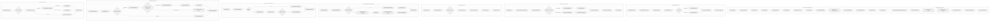

```mermaid
%%{init: {'theme': 'neutral', 'themeVariables': { 'primaryColor': '#f5f5f5', 'primaryTextColor': '#000', 'primaryBorderColor': '#999', 'lineColor': '#666', 'secondaryColor': '#eee', 'tertiaryColor': '#fff'}}}%%

flowchart TD
    %% Dependency Injection Flow
    subgraph DIFlow[Dependency Injection Flow]
        D1[StyleSystemServiceCollectionExtensions] --> D2[Services Registration]
        D2 --> D3[StyleSystemService Creation]
        D3 --> D4[AngleSharp Context Integration]
        D4 --> D5[Service Orchestration]
        D5 --> D6[Component Initialization]
        D6 --> D7[Document Attachment]
    end

    %% Initial Style Computation Flow
    subgraph InitialStyleFlow[Initial Style Computation Flow]
        A1[DOM Element] --> A2[StyleTreeResolver]
        A2 --> A3[RuleCollector]
        A3 --> A4[MatchedRules]
        A4 --> A5[CascadeResolver]
        A5 --> A6[CascadedStyle]
        A6 --> A7[InheritanceProcessor]
        A7 --> A8[InheritedStyle]
        A8 --> A9[ComputedStyleBuilder]
        A9 --> A10[VariableResolver & ValueCalculator]
        A10 --> A11[PropertyTreeManager]
        A11 --> A12[StylePropertyMapper]
        A12 --> A13[ComputedStyle]
        A13 --> A14[Layout System]
    end

    %% Style Recalculation Flow
    subgraph RecalcFlow[Style Recalculation Flow]
        B1[DOM/Style Change] --> B2[StyleInvalidationTracker]
        B2 --> B3[Affected Elements]
        B3 --> B4[StyleTreeResolver]
        B4 --> B5{Check Cache}
        B5 -->|Cache Miss| B6[Compute New Style]
        B5 -->|Cache Hit| B7[Reuse Cached Style]
        B6 --> B8[Update ComputedStyle]
        B7 --> B8
        B8 --> B9[Notify Layout System]
    end

    %% Multi-Threaded Style Flow
    subgraph ThreadedFlow[Multi-Threaded Style Flow]
        C1[DOM Change] --> C2[DocumentLifecycleCoordinator]
        C2 --> C3[StyleRecalcScheduler]
        C3 --> C4{Analyze Element Priority}
        C4 -->|Critical Path| C5[MainThreadStyleWork]
        C4 -->|Non-Critical Path| C6[WorkerThreadStylePool]
        C5 --> C7[Style Computation]
        C6 --> C8[Parallel Style Computation]
        C7 --> C9[Synchronize Results]
        C8 --> C9
        C9 --> C10[Update ComputedStyle]
        C10 --> C11[Notify Layout]
    end

    %% Task Scheduling Flow
    subgraph TaskFlow[Task Scheduling Flow]
        T1[Style Work Item] --> T2[StyleTaskScheduler]
        T2 --> T3{Priority-Based Queue}
        T3 --> T4[StyleTask Creation]
        T4 --> T5[Execute Style Tasks]
        T5 --> T6[Task Completion]
        T6 --> T7[Notify Callbacks]
    end

    %% Animation-Aware Style Processing
    subgraph AnimationFlow[Animation-Aware Style Processing]
        E1[Animation Update] --> E2[AnimationStyleEngine]
        E2 --> E3{Is Compositor-Only?}
        E3 -->|Yes| E4[Update Compositor Values]
        E3 -->|No| E5[Identify Animating Properties]
        E4 --> E6[Skip Main Thread]
        E5 --> E7[StyleEngine]
        E7 --> E8[Perform Minimal Style Update]
        E8 --> E9[Update ComputedStyle]
        E6 --> E10[Render Frame]
        E9 --> E10
    end

    %% Display-Locked Element Flow
    subgraph DisplayLockFlow[Display-Locked Element Flow]
        F1[DOM Element] --> F2[DisplayLockManager]
        F2 --> F3{Is Visible?}
        F3 -->|Yes| F4[Normal Style Computation]
        F3 -->|No| F5[Defer Computation]
        F5 --> F6[Record for Later]
        F6 --> F7{Scrolled Into View?}
        F7 -->|Yes| F8[Prioritize Computation]
        F4 --> F9[Update ComputedStyle]
        F8 --> F9
    end

    %% Variable Resolution Flow
    subgraph VariableFlow[Variable Resolution Flow]
        G1[CSS Variable Reference] --> G2[VariableResolver]
        G2 --> G3{Check Variable Cache}
        G3 -->|Cache Miss| G4[Resolve Dependencies]
        G3 -->|Cache Hit| G5[Return Cached Value]
        G4 --> G6{Check for Circular References}
        G6 -->|No Circularity| G7[Resolve Nested Variables]
        G6 -->|Circular Reference| G8[Use Fallback or Return NULL]
        G7 --> G9[Compute Final Value]
        G9 --> G10[Cache Result]
        G10 --> G11[Return Resolved Value]
        G5 --> G11
        G8 --> G11
    end

    %% Service Resolution Flow
    subgraph ServiceFlow[Service Resolution Flow]
        S1[StyleSystemService] --> S2{Service Requested}
        S2 --> S3[Check Service Cache]
        S3 -->|Cache Miss| S4[Try Resolve From Provider]
        S3 -->|Cache Hit| S5[Return Cached Service]
        S4 -->|Service Found| S6[Cache Service]
        S4 -->|Service Not Found| S7[Create Fallback]
        S6 --> S8[Return Service]
        S7 --> S8
        S5 --> S8
    end
```