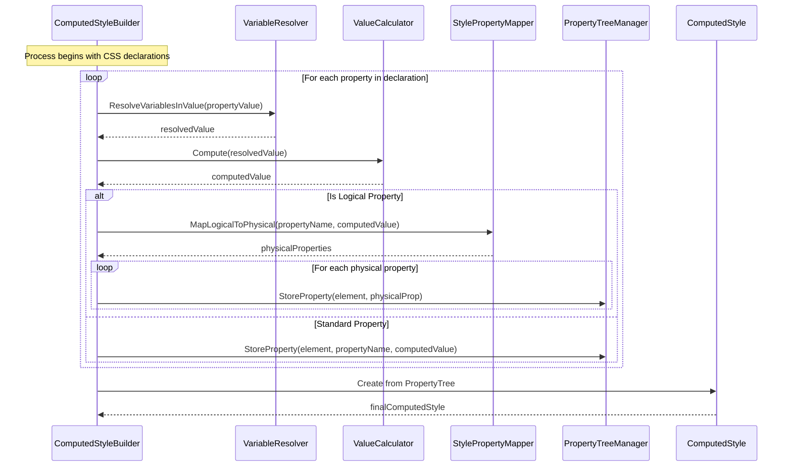

```mermaid
sequenceDiagram
    participant ComputedStyleBuilder
    participant VariableResolver
    participant ValueCalculator
    participant StylePropertyMapper
    participant PropertyTreeManager
    participant ComputedStyle

    Note over ComputedStyleBuilder: Process begins with CSS declarations

    loop For each property in declaration
        ComputedStyleBuilder->>VariableResolver: ResolveVariablesInValue(propertyValue)
        VariableResolver-->>ComputedStyleBuilder: resolvedValue

        ComputedStyleBuilder->>ValueCalculator: Compute(resolvedValue)
        ValueCalculator-->>ComputedStyleBuilder: computedValue

        alt Is Logical Property
            ComputedStyleBuilder->>StylePropertyMapper: MapLogicalToPhysical(propertyName, computedValue)
            StylePropertyMapper-->>ComputedStyleBuilder: physicalProperties

            loop For each physical property
                ComputedStyleBuilder->>PropertyTreeManager: StoreProperty(element, physicalProp)
            end
        else Standard Property
            ComputedStyleBuilder->>PropertyTreeManager: StoreProperty(element, propertyName, computedValue)
        end
    end

    ComputedStyleBuilder->>ComputedStyle: Create from PropertyTree
    ComputedStyle-->>ComputedStyleBuilder: finalComputedStyle
```