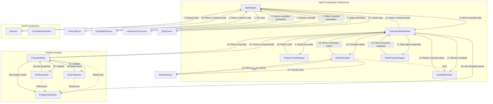

```mermaid
flowchart TD
    subgraph "Style Computation Components"
        STE[StyleEngine]
        CSB[ComputedStyleBuilder]
        PTM[PropertyTreeManager]
        VC[ValueCalculator]
        VR[VariableResolver]
        SPM[StylePropertyMapper]
    end
    
    subgraph "DOM Components"
        ELEM[Element]
        STYLE[CssStyleDeclaration]
    end
    
    subgraph "Property Storage"
        PTN[PropertyTreeNode]
        CS[ComputedStyle]
        BP[BoxProperties]
        TP[TextProperties]
    end
    
    %% ComputeElementStyle Flow
    ELEM -->|1. Request style| STE
    STE -->|2. Get rules| RC[RuleCollector]
    RC -->|3. Return matched rules| STE
    STE -->|4. Resolve cascade| CASC[CascadeResolver]
    CASC -->|5. Return cascaded declaration| STE
    STE -->|6. Apply inheritance| IP[InheritanceProcessor]
    IP -->|7. Return inherited declaration| STE
    STE -->|8. Build computed style| CSB
    CSB -->|9. Create tree node| PTM
    PTM -->|10. Return node| CSB
    
    %% Value computation flow
    CSB -->|11. Resolve variables| VR
    VR -->|12. Return resolved values| CSB
    CSB -->|13. Compute values| VC
    VC -->|14. Convert units| RD[RenderDevice]
    RD -->|15. Return device metrics| VC
    VC -->|16. Return computed values| CSB
    
    %% Logical property handling
    CSB -->|17. Map logical properties| SPM
    SPM -->|18. Return physical mappings| CSB
    
    %% Final style object construction
    CSB -->|19. Set computed values| PTN
    CSB -->|20. Create ComputedStyle| CS
    CS -->|21. Initialize| BP
    CS -->|22. Initialize| TP
    CS -->|23. Return final style| CSB
    CSB -->|24. Return computed style| STE
    STE -->|25. Cache style| SC[StyleCache]
    STE -->|26. Return computed style| ELEM
    
    %% Dependencies
    VC -.->|Uses| VR
    VC -.->|Uses| RD
    CS -.->|References| PTN
    BP -.->|References| PTN
    TP -.->|References| PTN
    
    %% Value access flow
    CS -->|Get property value| PTN
    BP -->|Get dimensions| CS
    TP -->|Get text properties| CS
```