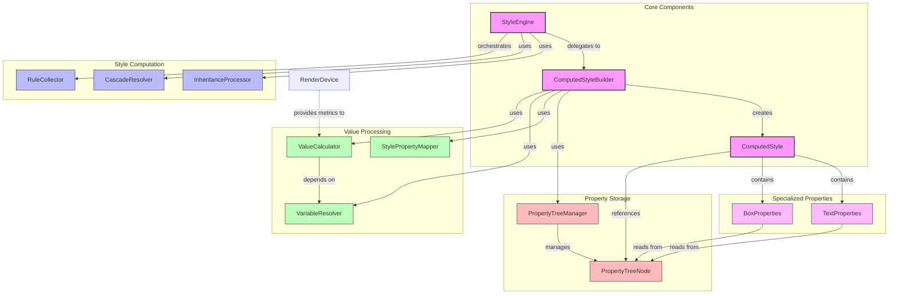

```mermaid
flowchart TB
    %% Main components
    subgraph "Core Components"
        SE[StyleEngine]
        CSB[ComputedStyleBuilder]
        CS[ComputedStyle]
    end
    
    subgraph "Style Computation"
        RC[RuleCollector]
        CR[CascadeResolver]
        IP[InheritanceProcessor]
    end
    
    subgraph "Value Processing"
        VC[ValueCalculator]
        VR[VariableResolver]
        SPM[StylePropertyMapper]
    end
    
    subgraph "Property Storage"
        PTM[PropertyTreeManager]
        PTN[PropertyTreeNode]
    end
    
    subgraph "Specialized Properties"
        BP[BoxProperties]
        TP[TextProperties]
    end
    
    %% Main component relationships with clear direction
    SE -->|orchestrates| RC
    SE -->|uses| CR
    SE -->|uses| IP
    SE -->|delegates to| CSB
    
    CSB -->|uses| VC
    CSB -->|uses| VR
    CSB -->|uses| SPM
    CSB -->|uses| PTM
    CSB -->|creates| CS
    
    VC -->|depends on| VR
    
    CS -->|references| PTN
    CS -->|contains| BP
    CS -->|contains| TP
    
    PTM -->|manages| PTN
    
    BP -->|reads from| PTN
    TP -->|reads from| PTN
    
    %% External system connections
    RD[RenderDevice] -.->|provides metrics to| VC
    
    classDef core fill:#f9f,stroke:#333,stroke-width:2px
    classDef computation fill:#bbf,stroke:#333,stroke-width:1px
    classDef value fill:#bfb,stroke:#333,stroke-width:1px
    classDef storage fill:#fbb,stroke:#333,stroke-width:1px
    classDef props fill:#fbf,stroke:#333,stroke-width:1px
    
    class SE,CSB,CS core
    class RC,CR,IP computation
    class VC,VR,SPM value
    class PTM,PTN storage
    class BP,TP props
```