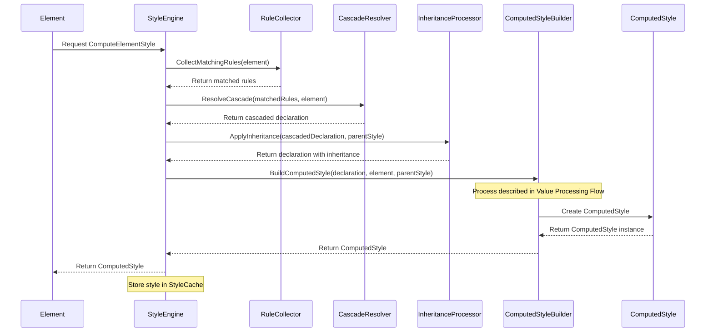

```mermaid
sequenceDiagram
    participant DOM as Element
    participant SE as StyleEngine
    participant RC as RuleCollector
    participant CR as CascadeResolver
    participant IP as InheritanceProcessor
    participant CSB as ComputedStyleBuilder
    participant CS as ComputedStyle
    
    DOM->>SE: Request ComputeElementStyle
    SE->>RC: CollectMatchingRules(element)
    RC-->>SE: Return matched rules
    
    SE->>CR: ResolveCascade(matchedRules, element)
    CR-->>SE: Return cascaded declaration
    
    SE->>IP: ApplyInheritance(cascadedDeclaration, parentStyle)
    IP-->>SE: Return declaration with inheritance
    
    SE->>CSB: BuildComputedStyle(declaration, element, parentStyle)
    
    Note over CSB: Process described in Value Processing Flow
    
    CSB->>CS: Create ComputedStyle
    CS-->>CSB: Return ComputedStyle instance
    
    CSB-->>SE: Return ComputedStyle
    SE-->>DOM: Return ComputedStyle
    
    Note over SE: Store style in StyleCache
```