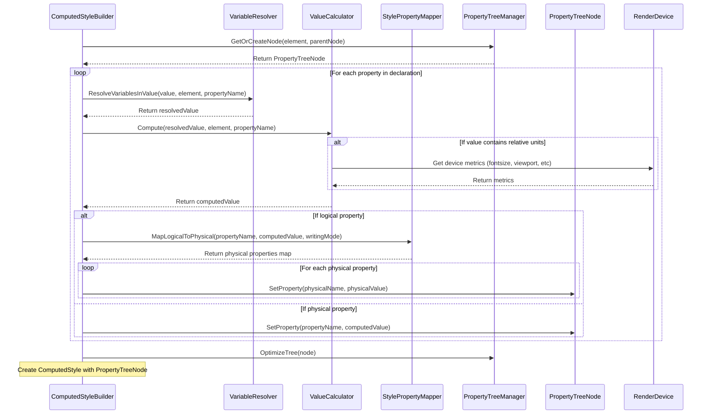

```mermaid
sequenceDiagram
    participant CSB as ComputedStyleBuilder
    participant VR as VariableResolver
    participant VC as ValueCalculator
    participant SPM as StylePropertyMapper
    participant PTM as PropertyTreeManager
    participant PTN as PropertyTreeNode
    participant RD as RenderDevice
    
    CSB->>PTM: GetOrCreateNode(element, parentNode)
    PTM-->>CSB: Return PropertyTreeNode
    
    loop For each property in declaration
        CSB->>VR: ResolveVariablesInValue(value, element, propertyName)
        VR-->>CSB: Return resolvedValue
        
        CSB->>VC: Compute(resolvedValue, element, propertyName)
        
        alt If value contains relative units
            VC->>RD: Get device metrics (fontsize, viewport, etc)
            RD-->>VC: Return metrics
        end
        
        VC-->>CSB: Return computedValue
        
        alt If logical property
            CSB->>SPM: MapLogicalToPhysical(propertyName, computedValue, writingMode)
            SPM-->>CSB: Return physical properties map
            
            loop For each physical property
                CSB->>PTN: SetProperty(physicalName, physicalValue)
            end
        else If physical property
            CSB->>PTN: SetProperty(propertyName, computedValue)
        end
    end
    
    CSB->>PTM: OptimizeTree(node)
    
    Note over CSB: Create ComputedStyle with PropertyTreeNode
```