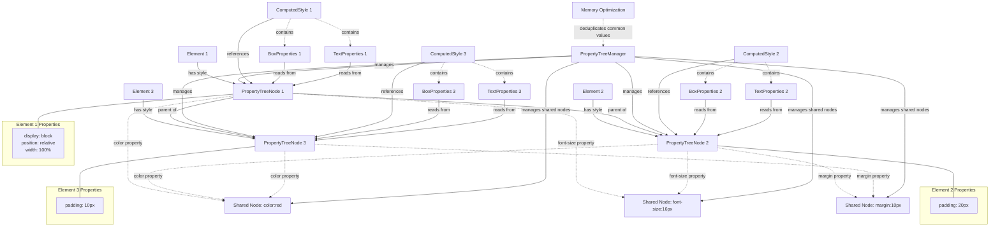

```mermaid
flowchart TD
    %% Elements with their styles
    E1[Element 1] -->|has style| PTN1[PropertyTreeNode 1]
    E2[Element 2] -->|has style| PTN2[PropertyTreeNode 2]
    E3[Element 3] -->|has style| PTN3[PropertyTreeNode 3]
    
    %% Parent-child relationships
    PTN1 -->|parent of| PTN2
    PTN1 -->|parent of| PTN3
    
    %% Shared nodes
    SN1[Shared Node: color:red] 
    SN2[Shared Node: font-size:16px]
    SN3[Shared Node: margin:10px]
    
    %% Property storage
    subgraph "Element 1 Properties"
        PTN1_props["
            display: block
            position: relative
            width: 100%
        "]
    end
    
    subgraph "Element 2 Properties"
        PTN2_props["
            padding: 20px
        "]
    end
    
    subgraph "Element 3 Properties"
        PTN3_props["
            padding: 10px
        "]
    end
    
    %% Connect nodes to their properties
    PTN1 --- PTN1_props
    PTN2 --- PTN2_props
    PTN3 --- PTN3_props
    
    %% Shared property references
    PTN1 -.->|color property| SN1
    PTN2 -.->|color property| SN1
    PTN3 -.->|color property| SN1
    
    PTN1 -.->|font-size property| SN2
    PTN2 -.->|font-size property| SN2
    
    PTN2 -.->|margin property| SN3
    PTN3 -.->|margin property| SN3
    
    %% Property Tree Manager
    PTM[PropertyTreeManager]
    PTM -->|manages| PTN1
    PTM -->|manages| PTN2
    PTM -->|manages| PTN3
    PTM -->|manages shared nodes| SN1
    PTM -->|manages shared nodes| SN2
    PTM -->|manages shared nodes| SN3
    
    %% Memory optimization
    OPT[Memory Optimization]
    OPT -.->|deduplicates common values| PTM
    
    %% ComputedStyle to PropertyTreeNode access
    CS1[ComputedStyle 1] -->|references| PTN1
    CS2[ComputedStyle 2] -->|references| PTN2
    CS3[ComputedStyle 3] -->|references| PTN3
    
    %% Specialized property groups
    BP1[BoxProperties 1] -->|reads from| PTN1
    TP1[TextProperties 1] -->|reads from| PTN1
    
    BP2[BoxProperties 2] -->|reads from| PTN2
    TP2[TextProperties 2] -->|reads from| PTN2
    
    BP3[BoxProperties 3] -->|reads from| PTN3
    TP3[TextProperties 3] -->|reads from| PTN3
    
    %% Connect ComputedStyle to specialized properties
    CS1 -.->|contains| BP1
    CS1 -.->|contains| TP1
    
    CS2 -.->|contains| BP2
    CS2 -.->|contains| TP2
    
    CS3 -.->|contains| BP3
    CS3 -.->|contains| TP3
```