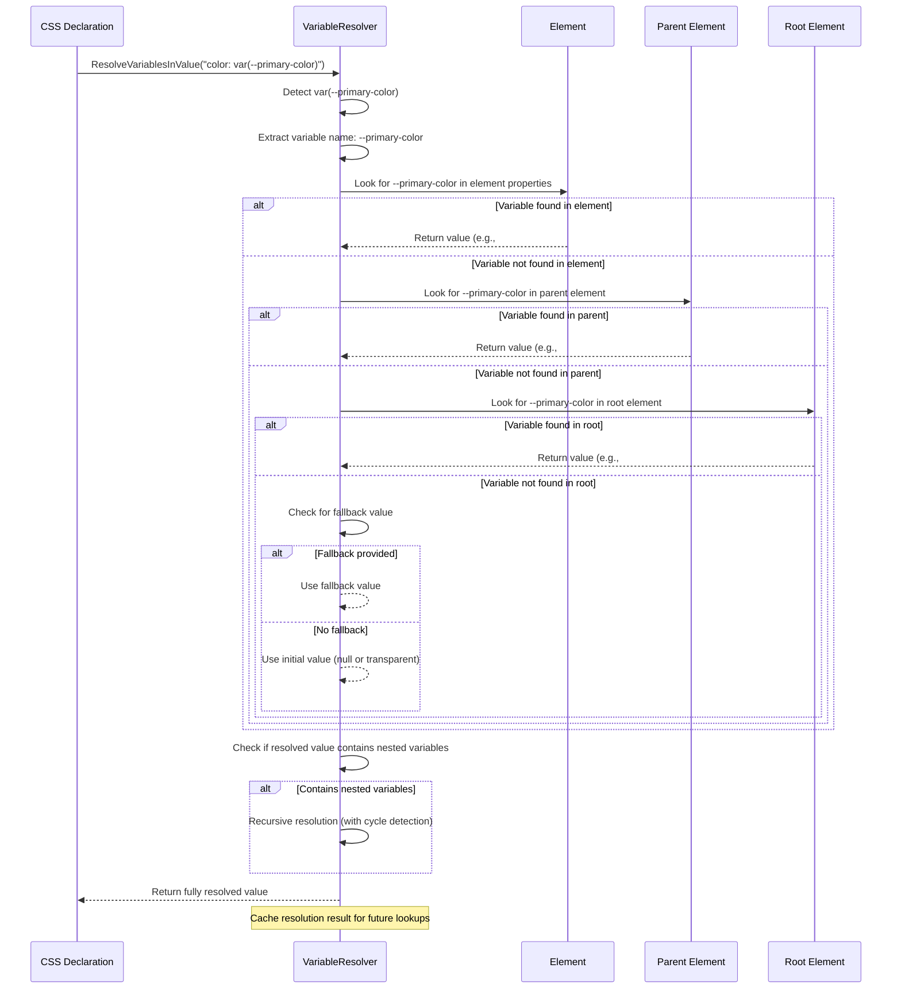

```mermaid
sequenceDiagram
    participant CSS as CSS Declaration
    participant VR as VariableResolver
    participant E as Element
    participant P as Parent Element
    participant R as Root Element
    
    CSS->>VR: ResolveVariablesInValue("color: var(--primary-color)")
    
    VR->>VR: Detect var(--primary-color)
    VR->>VR: Extract variable name: --primary-color
    
    VR->>E: Look for --primary-color in element properties
    
    alt Variable found in element
        E-->>VR: Return value (e.g., #1a73e8)
    else Variable not found in element
        VR->>P: Look for --primary-color in parent element
        
        alt Variable found in parent
            P-->>VR: Return value (e.g., #1a73e8)
        else Variable not found in parent
            VR->>R: Look for --primary-color in root element
            
            alt Variable found in root
                R-->>VR: Return value (e.g., #1a73e8)
            else Variable not found in root
                VR->>VR: Check for fallback value
                
                alt Fallback provided
                    VR-->>VR: Use fallback value
                else No fallback
                    VR-->>VR: Use initial value (null or transparent)
                end
            end
        end
    end
    
    VR->>VR: Check if resolved value contains nested variables
    
    alt Contains nested variables
        VR->>VR: Recursive resolution (with cycle detection)
    end
    
    VR-->>CSS: Return fully resolved value
    
    Note over VR: Cache resolution result for future lookups
```