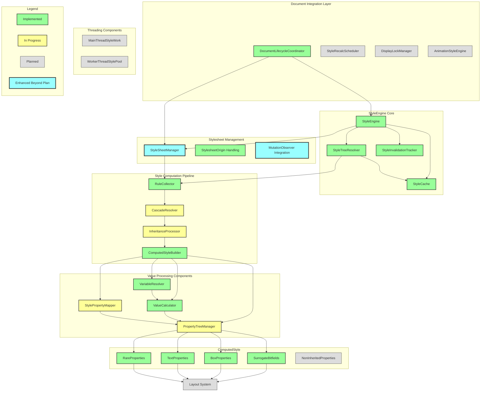

```mermaid
flowchart TB
    %% Document Integration Layer
    subgraph DocumentLayer[Document Integration Layer]
        DLC[DocumentLifecycleCoordinator]:::implemented
        SRS[StyleRecalcScheduler]:::planned
        DLM[DisplayLockManager]:::planned
        ASE[AnimationStyleEngine]:::planned
    end

    %% StyleEngine Core
    subgraph EngineCore[StyleEngine Core]
        SE[StyleEngine]:::implemented
        STR[StyleTreeResolver]:::implemented
        SIT[StyleInvalidationTracker]:::implemented
        SC[StyleCache]:::implemented
    end
    
    %% Style Computation Pipeline
    subgraph ComputationPipeline[Style Computation Pipeline]
        RC[RuleCollector]:::implemented
        CR[CascadeResolver]:::inProgress
        IP[InheritanceProcessor]:::inProgress
        CSB[ComputedStyleBuilder]:::implemented
    end
    
    %% Value Processing Components
    subgraph ValueProcessing[Value Processing Components]
        VR[VariableResolver]:::implemented
        VC[ValueCalculator]:::implemented
        PTM[PropertyTreeManager]:::inProgress
        SPM[StylePropertyMapper]:::inProgress
    end
    
    %% Stylesheet Management
    subgraph StylesheetManagement[Stylesheet Management]
        SSM[StyleSheetManager]:::enhanced
        SSO[StylesheetOrigin Handling]:::implemented
        MO[MutationObserver Integration]:::enhanced
    end
    
    %% Output Layer
    subgraph OutputLayer[ComputedStyle]
        SBF[SurrogateBitfields]:::implemented
        BP[BoxProperties]:::implemented
        TP[TextProperties]:::implemented
        RP[RareProperties]:::implemented
        NIP[NonInheritedProperties]:::planned
    end
    
    %% Threading Components
    subgraph ThreadingComponents[Threading Components]
        MTSW[MainThreadStyleWork]:::planned
        WTSP[WorkerThreadStylePool]:::planned
    end
    
    %% Layout System
    LS[Layout System]:::planned
    
    %% Connections between components
    DLC --> SE
    DLC --> SSM
    SSM --> RC
    
    SE --> STR
    SE --> SIT
    SE --> SC
    SE --> SSM
    
    STR --> RC
    STR --> SC
    
    RC --> CR
    CR --> IP
    IP --> CSB
    
    CSB --> VR
    CSB --> VC
    CSB --> PTM
    CSB --> SPM
    
    VR --> VC
    VC --> PTM
    SPM --> PTM
    
    PTM --> SBF
    PTM --> BP
    PTM --> TP
    PTM --> RP
    
    SBF --> LS
    BP --> LS
    TP --> LS
    RP --> LS
    
    %% Style classes
    class DocumentLayer,EngineCore,ComputationPipeline,ValueProcessing,OutputLayer,ThreadingComponents,StylesheetManagement interface
    
    %% Component styling
    classDef implemented fill:#9f9,stroke:#333,stroke-width:2px
    classDef inProgress fill:#ff9,stroke:#333,stroke-width:2px
    classDef planned fill:#ddd,stroke:#333,stroke-width:1px
    classDef enhanced fill:#9ff,stroke:#333,stroke-width:3px
    
    %% Legend
    subgraph Legend
        I[Implemented]:::implemented
        P[In Progress]:::inProgress
        PL[Planned]:::planned
        E[Enhanced Beyond Plan]:::enhanced
    end
```