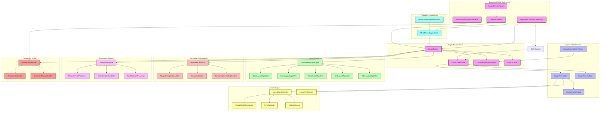

```mermaid
flowchart TB
    %% Document Integration Layer
    subgraph DocumentLayer[Document Integration Layer]
        DLC[DocumentLifecycleCoordinator]
        LRT[LayoutRecalcTrigger]
        PSM[PaintSynchronizationManager]
        LSC[LayoutScheduler]
    end

    %% LayoutEngine Core
    subgraph EngineCore[LayoutEngine Core]
        LE[LayoutEngine]
        LTB[LayoutTreeBuilder]
        LIT[LayoutInvalidationTracker]
        LC[LayoutCache]
    end
    
    %% Layout Tree Structure
    subgraph TreeStructure[Layout Tree Structure]
        LTN[LayoutTreeNode]
        LPM[LayoutPropertyMap]
        LTF[LayoutTreeFactory]
        LDT[LayoutDependencyTracker]
    end
    
    %% Layout Algorithms
    subgraph LayoutAlgorithms[Layout Algorithms]
        BLA[BlockLayoutAlgorithm]
        ILA[InlineLayoutAlgorithm]
        FLA[FlexLayoutAlgorithm]
        GLA[GridLayoutAlgorithm]
        TLA[TableLayoutAlgorithm]
        LRE[LayoutResolutionEngine]
    end
    
    %% Box Model
    subgraph BoxModel[Box Model Components]
        BMC[BoxModelCalculator]
        MCC[MarginCollapseCalculator]
        BMB[BoxModelBuilder]
        CFC[ContainingFormattingContext]
    end
    
    %% Positioning System
    subgraph PositioningSystem[Positioning System]
        PE[PositioningEngine]
        AFP[AbsoluteFixedPositioner]
        SPC[StickyPositionController]
        FCP[FloatCollisionProcessor]
    end
    
    %% Output Layer
    subgraph OutputLayer[Layout Output]
        LBOX[LayoutBoxGeometry]
        LTX[LayoutTextMetrics]
        VRR[VisualRenderRectangle]
        OFD[OverflowData]
        ZIC[ZIndexContext]
    end
    
    %% Threading Components
    subgraph ThreadingComponents[Threading Components]
        MTLW[MainThreadLayoutWork]
        LTSA[LayoutTaskSchedulerAdapter]
    end
    
    %% Rendering Bridge
    subgraph RenderingBridge[Rendering Bridge]
        RDR[RenderLayerBuilder]
        DPM[DisplayListManager]
        GTC[GeometryChangeNotifier]
    end
    
    %% Style System Connection
    SS[Style System]
    
    %% Connections between components
    DLC --> LE
    DLC --> SS
    LRT --> LSC
    LSC --> MTLW
    LE --> LTB
    LE --> LIT
    LTB --> LTN
    LTB --> LTF
    LDT --> LIT
    
    SS --> LTB
    
    LTN --> LPM
    
    LRE --> BLA
    LRE --> ILA
    LRE --> FLA
    LRE --> GLA
    LRE --> TLA
    
    LE --> LRE
    LE --> BMC
    LE --> PE
    
    BMC --> MCC
    BMC --> BMB
    BMC --> CFC
    
    PE --> AFP
    PE --> SPC
    PE --> FCP
    
    LTN --> LBOX
    LTN --> LTX
    LBOX --> VRR
    LBOX --> OFD
    LBOX --> ZIC
    
    MTLW --> LE
    LTSA --> MTLW
    
    LE --> RDR
    RDR --> DPM
    RDR --> GTC
    
    LE --> LC
    
    LSC --> LE
    PSM --> RDR
    
    %% Component styling
    classDef core fill:#f9f,stroke:#333,stroke-width:2px
    classDef tree fill:#bbf,stroke:#333,stroke-width:1px
    classDef algo fill:#bfb,stroke:#333,stroke-width:1px
    classDef box fill:#fbb,stroke:#333,stroke-width:1px
    classDef pos fill:#fbf,stroke:#333,stroke-width:1px
    classDef output fill:#ff9,stroke:#333,stroke-width:2px
    classDef thread fill:#9ff,stroke:#333,stroke-width:1px
    classDef render fill:#f99,stroke:#333,stroke-width:1px
    
    class LE,LTB,LIT,LC core
    class LTN,LPM,LTF,LDT tree
    class BLA,ILA,FLA,GLA,TLA,LRE algo
    class BMC,MCC,BMB,CFC box
    class PE,AFP,SPC,FCP pos
    class LBOX,LTX,VRR,OFD,ZIC output
    class MTLW,LTSA thread
    class RDR,DPM,GTC render
    class DLC,LRT,PSM,LSC core
```