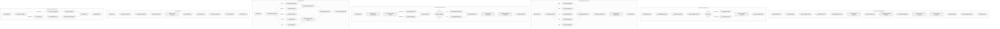

```mermaid
%%{init: {'theme': 'neutral', 'themeVariables': { 'primaryColor': '#f5f5f5', 'primaryTextColor': '#000', 'primaryBorderColor': '#999', 'lineColor': '#666', 'secondaryColor': '#eee', 'tertiaryColor': '#fff'}}}%%

flowchart TD
    %% Initial Layout Flow
    subgraph InitialLayoutFlow[Initial Layout Computation Flow]
        A1[Styled DOM Element] --> A2[LayoutTreeBuilder]
        A2 --> A3[LayoutTreeNode Creation]
        A3 --> A4[Box Model Properties]
        A4 --> A5[Layout Algorithm Selection]
        A5 --> A6[Containing Block Resolution]
        A6 --> A7[Box Sizing Calculation]
        A7 --> A8[Margin/Border/Padding Application]
        A8 --> A9[Content Size Calculation]
        A9 --> A10[Positioning & Float Processing]
        A10 --> A11[Layout Coordinate Finalization]
        A11 --> A12[Overflow Handling]
        A12 --> A13[Final LayoutBox Geometry]
        A13 --> A14[Rendering System]
    end

    %% Layout Recalculation Flow
    subgraph RecalcFlow[Layout Recalculation Flow]
        B1[Style/DOM Change] --> B2[LayoutInvalidationTracker]
        B2 --> B3[Affected Layout Nodes]
        B3 --> B4[Layout Dependency Graph]
        B4 --> B5{Check Cache}
        B5 -->|Cache Miss| B6[Calculate New Layout]
        B5 -->|Cache Hit| B7[Reuse Cached Layout]
        B6 --> B8[Update LayoutBox Geometry]
        B7 --> B8
        B8 --> B9[Notify Rendering System]
    end

    %% Multi-Algorithm Layout Flow
    subgraph AlgorithmFlow[Multi-Algorithm Layout Flow]
        C1[Layout Context] --> C2[Display Type Analysis]
        C2 -->|Block| C3[BlockLayoutAlgorithm]
        C2 -->|Inline| C4[InlineLayoutAlgorithm]
        C2 -->|Flex| C5[FlexLayoutAlgorithm]
        C2 -->|Grid| C6[GridLayoutAlgorithm]
        C2 -->|Table| C7[TableLayoutAlgorithm]
        C3 & C4 & C5 & C6 & C7 --> C8[Layout Resolution Engine]
        C8 --> C9[Composite Layout Result]
        C9 --> C10[Coordinate Space Transformation]
        C10 --> C11[Final Geometry]
    end

    %% Box Model Calculation Flow
    subgraph BoxModelFlow[Box Model Calculation Flow]
        D1[Computed Style] --> D2[Box Model Type Determination]
        D2 --> D3[Box Sizing Property Analysis]
        D3 -->|Content-Box| D4[Content Based Sizing]
        D3 -->|Border-Box| D5[Border Based Sizing]
        D4 & D5 --> D6[Margin Processing]
        D6 --> D7{Margins Collapsible?}
        D7 -->|Yes| D8[Margin Collapse Calculator]
        D7 -->|No| D9[Direct Margin Application]
        D8 & D9 --> D10[Final Box Dimensions]
        D10 --> D11[Containing Block Constraints]
        D11 --> D12[Min/Max Width/Height Constraints]
        D12 --> D13[Final Box Geometry]
    end

    %% Positioning Flow
    subgraph PositioningFlow[Positioning Flow]
        E1[Layout Node] --> E2[Position Property Analysis]
        E2 -->|Static| E3[Normal Flow Positioning]
        E2 -->|Relative| E4[Relative Positioning]
        E2 -->|Absolute| E5[Absolute Positioning]
        E2 -->|Fixed| E6[Fixed Positioning]
        E2 -->|Sticky| E7[Sticky Positioning]
        E3 & E4 --> E8[In-Flow Coordinate System]
        E5 & E6 & E7 --> E9[Out-of-Flow Coordinate System]
        E8 & E9 --> E10[Z-Index Stacking Context]
        E10 --> E11[Final Screen Coordinates]
    end

    %% Text Layout Flow
    subgraph TextLayoutFlow[Text Layout Flow]
        F1[Text Content] --> F2[Font Metrics Resolution]
        F2 --> F3[Line Breaking Algorithm]
        F3 --> F4[Text Runs Generation]
        F4 --> F5[Bidirectional Text Processing]
        F5 --> F6[Glyph Positioning]
        F6 --> F7[Text Decorations]
        F7 --> F8[Inline Box Construction]
        F8 --> F9[Line Box Assembly]
        F9 --> F10[Final Text Layout]
    end

    %% Threading & Scheduling Flow
    subgraph ThreadingFlow[Threading & Scheduling Flow]
        G1[Layout Request] --> G2[Priority Determination]
        G2 -->|Critical Path| G3[Main Thread Immediate]
        G2 -->|Non-Critical| G4[Deferred Queue]
        G3 --> G5[Synchronous Layout]
        G4 --> G6[Next Animation Frame]
        G6 --> G7[Batched Layout Processing]
        G5 & G7 --> G8[Layout Results]
        G8 --> G9[Rendering Signal]
    end
```