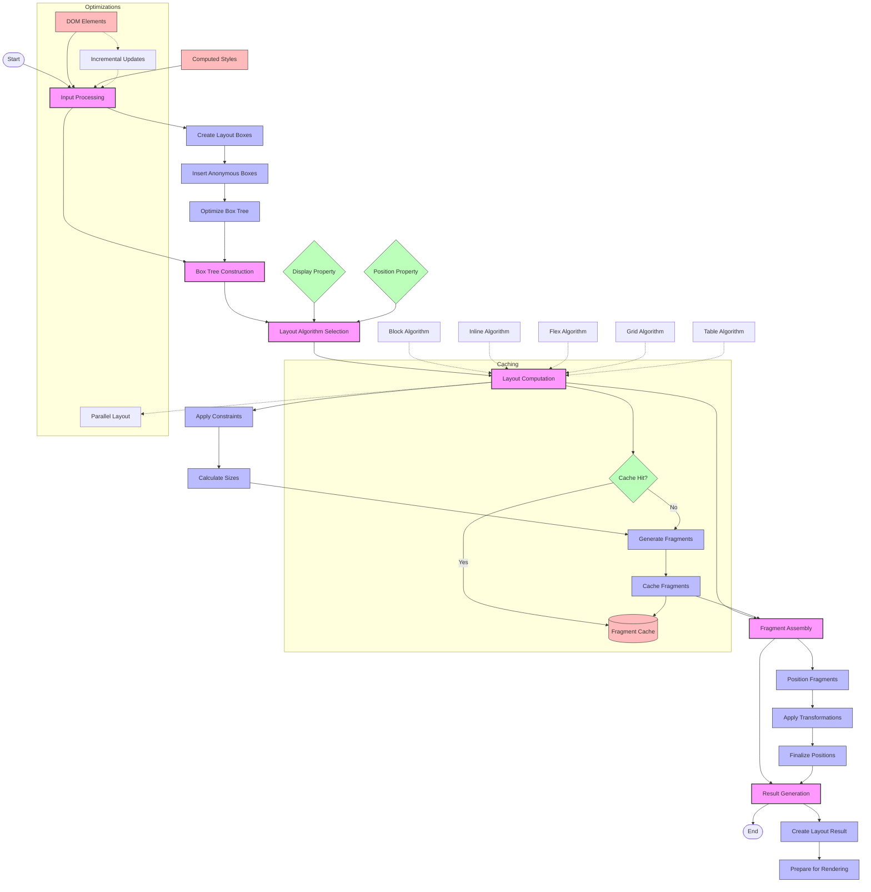

```mermaid
flowchart TD
    %% Main Pipeline Phases
    Start([Start]) --> InputProcessing
    InputProcessing[Input Processing] --> BoxConstruction
    BoxConstruction[Box Tree Construction] --> AlgorithmSelection
    AlgorithmSelection[Layout Algorithm Selection] --> LayoutComputation
    LayoutComputation[Layout Computation] --> FragmentAssembly
    FragmentAssembly[Fragment Assembly] --> ResultGeneration
    ResultGeneration[Result Generation] --> End([End])

    %% Input Processing Details
    DOM[DOM Elements] --> InputProcessing
    Styles[Computed Styles] --> InputProcessing

    %% Box Tree Construction Details
    InputProcessing --> CreateBoxes[Create Layout Boxes]
    CreateBoxes --> InsertAnonymous[Insert Anonymous Boxes]
    InsertAnonymous --> OptimizeTree[Optimize Box Tree]
    OptimizeTree --> BoxConstruction

    %% Algorithm Selection Details
    DisplayProperty{Display Property} --> AlgorithmSelection
    PositionProperty{Position Property} --> AlgorithmSelection

    %% Layout Computation Details
    BlockAlgo[Block Algorithm] -.-> LayoutComputation
    InlineAlgo[Inline Algorithm] -.-> LayoutComputation
    FlexAlgo[Flex Algorithm] -.-> LayoutComputation
    GridAlgo[Grid Algorithm] -.-> LayoutComputation
    TableAlgo[Table Algorithm] -.-> LayoutComputation
    
    LayoutComputation --> ApplyConstraints[Apply Constraints]
    ApplyConstraints --> CalculateSize[Calculate Sizes]
    CalculateSize --> GenerateFragments[Generate Fragments]
    GenerateFragments --> CacheFragments[Cache Fragments]
    CacheFragments --> FragmentAssembly

    %% Fragment Assembly Details
    FragmentAssembly --> PositionFragments[Position Fragments]
    PositionFragments --> ApplyTransforms[Apply Transformations]
    ApplyTransforms --> FinalizePositions[Finalize Positions]
    FinalizePositions --> ResultGeneration

    %% Result Generation Details
    ResultGeneration --> CreateLayoutResult[Create Layout Result]
    CreateLayoutResult --> PrepareForRendering[Prepare for Rendering]

    %% Cache and Optimization
    subgraph Caching
        FragmentCache[(Fragment Cache)]
        LayoutComputation --> CheckCache{Cache Hit?}
        CheckCache -->|Yes| FragmentCache
        CheckCache -->|No| GenerateFragments
        CacheFragments --> FragmentCache
    end

    %% Optimization Processes
    subgraph Optimizations
        ParallelLayout[Parallel Layout]
        IncrementalUpdates[Incremental Updates]
        LayoutComputation -.-> ParallelLayout
        DOM -.-> IncrementalUpdates
        IncrementalUpdates -.-> InputProcessing
    end

    %% Styling
    classDef phase fill:#f9f,stroke:#333,stroke-width:2px
    classDef operation fill:#bbf,stroke:#333,stroke-width:1px
    classDef decision fill:#bfb,stroke:#333,stroke-width:1px
    classDef data fill:#fbb,stroke:#333,stroke-width:1px
    
    class InputProcessing,BoxConstruction,AlgorithmSelection,LayoutComputation,FragmentAssembly,ResultGeneration phase
    class CreateBoxes,InsertAnonymous,OptimizeTree,ApplyConstraints,CalculateSize,GenerateFragments,CacheFragments,PositionFragments,ApplyTransforms,FinalizePositions,CreateLayoutResult,PrepareForRendering operation
    class DisplayProperty,PositionProperty,CheckCache decision
    class DOM,Styles,FragmentCache data
```