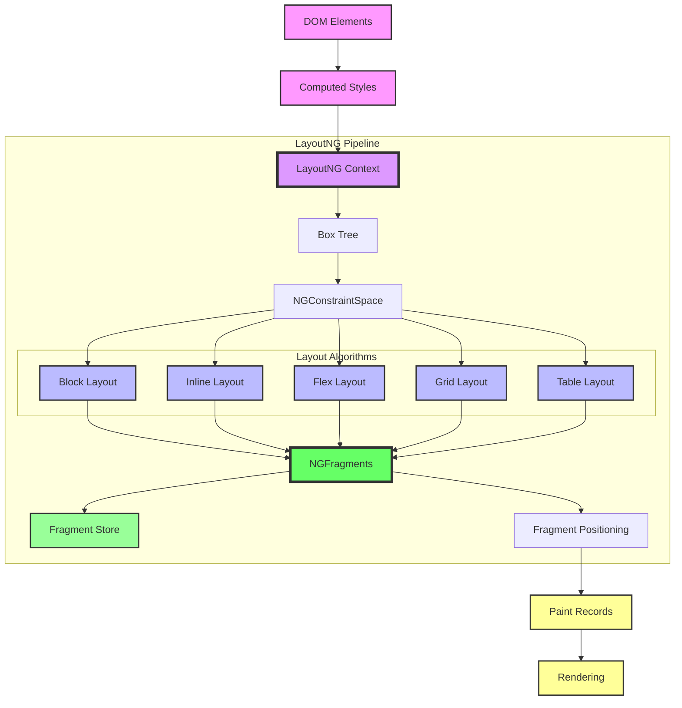

```mermaid
flowchart TB
    DOM[DOM Elements] --> CS[Computed Styles]
    CS --> LNC[LayoutNG Context]
    
    subgraph "LayoutNG Pipeline"
        LNC --> BT[Box Tree]
        BT --> CSPACE[NGConstraintSpace]
        
        subgraph "Layout Algorithms"
            BLA[Block Layout]
            ILA[Inline Layout]
            FLA[Flex Layout]
            GLA[Grid Layout]
            TLA[Table Layout]
        end
        
        CSPACE --> BLA & ILA & FLA & GLA & TLA
        BLA & ILA & FLA & GLA & TLA --> FRAG[NGFragments]
        FRAG --> FSTORE[Fragment Store]
        FRAG --> POS[Fragment Positioning]
    end
    
    POS --> PR[Paint Records]
    PR --> RENDER[Rendering]
    
    classDef input fill:#f9f,stroke:#333,stroke-width:2px
    classDef fragment fill:#9f9,stroke:#333,stroke-width:2px
    classDef algorithms fill:#bbf,stroke:#333,stroke-width:2px
    classDef output fill:#ff9,stroke:#333,stroke-width:2px
    
    class DOM,CS input
    class FRAG,FSTORE fragment
    class BLA,ILA,FLA,GLA,TLA algorithms
    class PR,RENDER output
    
    style LNC fill:#d9f,stroke:#333,stroke-width:4px
    style FRAG fill:#6f6,stroke:#333,stroke-width:4px
```