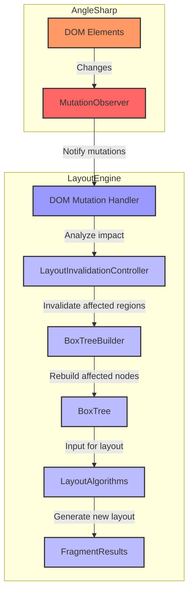

```mermaid
flowchart TB
    subgraph AngleSharp
        DOM[DOM Elements]
        MO[MutationObserver]
    end
    
    subgraph LayoutEngine
        DMH[DOM Mutation Handler]
        LIC[LayoutInvalidationController]
        BTB[BoxTreeBuilder]
        BT[BoxTree]
        LA[LayoutAlgorithms]
        FR[FragmentResults]
    end
    
    DOM -->|Changes| MO
    MO -->|Notify mutations| DMH
    DMH -->|Analyze impact| LIC
    LIC -->|Invalidate affected regions| BTB
    BTB -->|Rebuild affected nodes| BT
    BT -->|Input for layout| LA
    LA -->|Generate new layout| FR
    
    classDef anglesharp fill:#f96,stroke:#333,stroke-width:2px
    classDef engine fill:#bbf,stroke:#333,stroke-width:2px
    class DOM,MO anglesharp
    class DMH,LIC,BTB,BT,LA,FR engine
    
    style MO fill:#f66,stroke:#333,stroke-width:2px
    style DMH fill:#99f,stroke:#333,stroke-width:2px
```