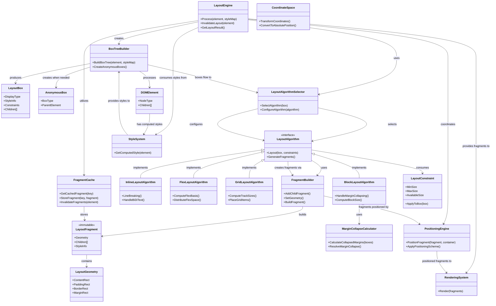

```mermaid
classDiagram
    %% Core Systems
    class LayoutEngine {
        +Process(element, styleMap)
        +InvalidateLayout(element)
        +GetLayoutResult()
    }
    
    %% Box Tree Components
    class BoxTreeBuilder {
        +BuildBoxTree(element, styleMap)
        +CreateAnonymousBoxes()
    }
    
    class LayoutBox {
        +DisplayType
        +StyleInfo
        +Constraints
        +Children[]
    }
    
    class AnonymousBox {
        +BoxType
        +ParentElement
    }
    
    %% Layout Algorithms
    class LayoutAlgorithmSelector {
        +SelectAlgorithm(box)
        +ConfigureAlgorithm(algorithm)
    }
    
    class LayoutAlgorithm {
        <<interface>>
        +Layout(box, constraints)
        +GenerateFragments()
    }
    
    class BlockLayoutAlgorithm {
        +HandleMarginCollapsing()
        +ComputeBlockSize()
    }
    
    class InlineLayoutAlgorithm {
        +LineBreaking()
        +HandleBiDiText()
    }
    
    class FlexLayoutAlgorithm {
        +ComputeFlexBasis()
        +DistributeFlexSpace()
    }
    
    class GridLayoutAlgorithm {
        +ComputeTrackSizes()
        +PlaceGridItems()
    }
    
    %% Fragment System
    class LayoutFragment {
        <<immutable>>
        +Geometry
        +Children[]
        +StyleInfo
    }
    
    class FragmentBuilder {
        +AddChildFragment()
        +SetGeometry()
        +BuildFragment()
    }
    
    class FragmentCache {
        +GetCachedFragment(key)
        +StoreFragment(key, fragment)
        +InvalidateFragments(element)
    }
    
    %% Constraint and Geometry
    class LayoutConstraint {
        +MinSize
        +MaxSize
        +AvailableSize
        +ApplyToBox(box)
    }
    
    class LayoutGeometry {
        +ContentRect
        +PaddingRect
        +BorderRect
        +MarginRect
    }
    
    class MarginCollapseCalculator {
        +CalculateCollapsedMargins(boxes)
        +ResolveMarginCollapse()
    }
    
    %% Positioning System
    class PositioningEngine {
        +PositionFragment(fragment, container)
        +ApplyPositioningScheme()
    }
    
    class CoordinateSpace {
        +TransformCoordinates()
        +ConvertToAbsolutePosition()
    }
    
    %% External Systems
    class StyleSystem {
        +GetComputedStyle(element)
    }
    
    class DOMElement {
        +NodeType
        +Children[]
    }
    
    class RenderingSystem {
        +Render(fragments)
    }
    
    %% Relationships - Core Flow
    LayoutEngine --> BoxTreeBuilder: creates
    LayoutEngine --> LayoutAlgorithmSelector: uses
    LayoutEngine --> FragmentCache: utilizes
    LayoutEngine --> PositioningEngine: coordinates
    
    BoxTreeBuilder --> LayoutBox: produces
    BoxTreeBuilder --> AnonymousBox: creates when needed
    
    %% Algorithm Relationships
    LayoutAlgorithmSelector --> LayoutAlgorithm: selects
    LayoutAlgorithm <|-- BlockLayoutAlgorithm: implements
    LayoutAlgorithm <|-- InlineLayoutAlgorithm: implements
    LayoutAlgorithm <|-- FlexLayoutAlgorithm: implements
    LayoutAlgorithm <|-- GridLayoutAlgorithm: implements
    
    LayoutAlgorithm --> FragmentBuilder: uses
    LayoutAlgorithm --> LayoutConstraint: consumes
    
    BlockLayoutAlgorithm --> MarginCollapseCalculator: uses
    
    %% Fragment Relationships
    FragmentBuilder --> LayoutFragment: builds
    LayoutFragment --> LayoutGeometry: contains
    FragmentCache --> LayoutFragment: stores
    
    %% External System Relationships
    LayoutEngine --> StyleSystem: consumes styles from
    BoxTreeBuilder --> DOMElement: processes
    LayoutEngine --> RenderingSystem: provides fragments to
    
    %% Layout Pipeline Flow
    DOMElement --> StyleSystem: has computed styles
    StyleSystem --> BoxTreeBuilder: provides styles to
    BoxTreeBuilder --> LayoutAlgorithmSelector: boxes flow to
    LayoutAlgorithmSelector --> LayoutAlgorithm: configures
    LayoutAlgorithm --> FragmentBuilder: creates fragments via
    FragmentBuilder --> PositioningEngine: fragments positioned by
    PositioningEngine --> RenderingSystem: positioned fragments to
```