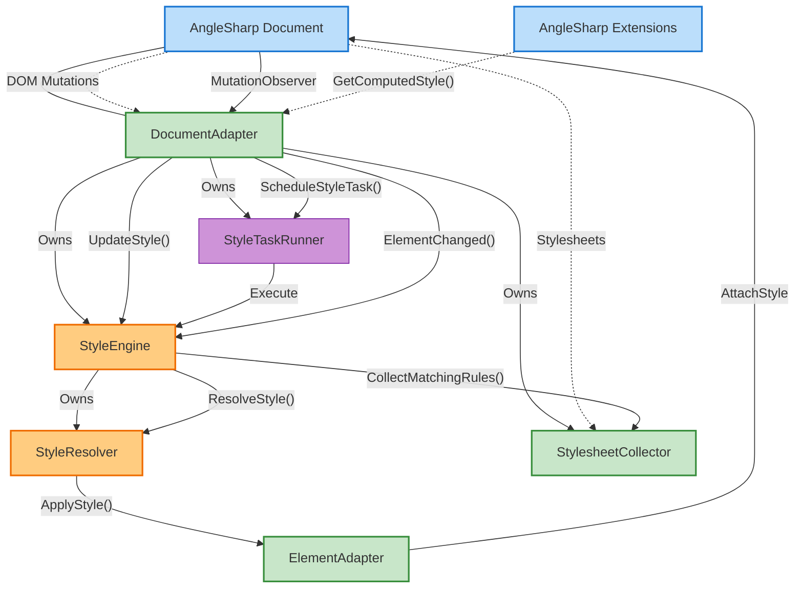

```mermaid
flowchart TD
    %% Core components
    AngleSharpDocument["AngleSharp Document"]
    DocumentAdapter["DocumentAdapter"]
    StyleEngine["StyleEngine"]
    StyleResolver["StyleResolver"]
    ElementAdapter["ElementAdapter"]
    StylesheetCollector["StylesheetCollector"]
    TaskRunner["StyleTaskRunner"]
    
    %% Ownership and relationships
    AngleSharpDocument --- DocumentAdapter
    DocumentAdapter -->|"Owns"| StyleEngine
    DocumentAdapter -->|"Owns"| TaskRunner
    DocumentAdapter -->|"Owns"| StylesheetCollector
    StyleEngine -->|"Owns"| StyleResolver
    
    %% Data flow between components
    AngleSharpDocument -.->|"DOM Mutations"| DocumentAdapter
    AngleSharpDocument -.->|"Stylesheets"| StylesheetCollector
    DocumentAdapter -->|"UpdateStyle()"| StyleEngine
    DocumentAdapter -->|"ScheduleStyleTask()"| TaskRunner
    TaskRunner -->|"Execute"| StyleEngine
    StyleEngine -->|"CollectMatchingRules()"| StylesheetCollector
    StyleEngine -->|"ResolveStyle()"| StyleResolver
    StyleResolver -->|"ApplyStyle()"| ElementAdapter
    ElementAdapter -->|"AttachStyle"| AngleSharpDocument
    
    %% Mutation handling
    AngleSharpDocument -->|"MutationObserver"| DocumentAdapter
    DocumentAdapter -->|"ElementChanged()"| StyleEngine
    
    %% Extension methods (for API)
    AngleSharpExt[AngleSharp Extensions]
    AngleSharpExt -.->|"GetComputedStyle()"| DocumentAdapter
    
    classDef anglesharp fill:#bbdefb,stroke:#1976d2,stroke-width:2px
    classDef adapter fill:#c8e6c9,stroke:#388e3c,stroke-width:2px
    classDef engine fill:#ffcc80,stroke:#ef6c00,stroke-width:2px
    classDef task fill:#ce93d8,stroke:#7b1fa2,stroke-width:1px
    
    class AngleSharpDocument,AngleSharpExt anglesharp
    class DocumentAdapter,ElementAdapter,StylesheetCollector adapter
    class StyleEngine,StyleResolver engine
    class TaskRunner task
```