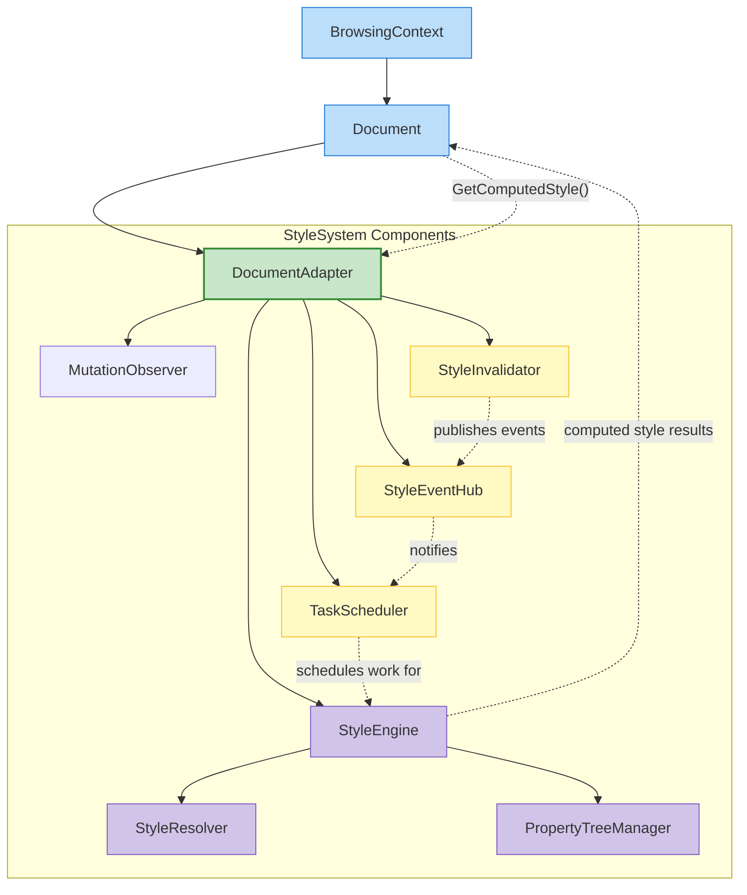

```mermaid
flowchart TD
    %% Document-centric architecture
    BrowsingContext --> Document
    
    Document --> DocumentAdapter
    
    subgraph StyleSystem["StyleSystem Components"]
        DocumentAdapter --> StyleEngine
        DocumentAdapter --> MutationObserver
        DocumentAdapter --> StyleInvalidator
        DocumentAdapter --> StyleEventHub
        DocumentAdapter --> TaskScheduler
        
        StyleEngine --> StyleResolver
        StyleEngine --> PropertyTreeManager
        
        StyleInvalidator -.->|publishes events| StyleEventHub
        StyleEventHub -.->|notifies| TaskScheduler
        TaskScheduler -.->|schedules work for| StyleEngine
    end
    
    %% Integration points
    Document -.->|"GetComputedStyle()"| DocumentAdapter
    StyleEngine -.->|computed style results| Document
    
    classDef anglesharp fill:#bbdefb,stroke:#1976d2,stroke-width:1px
    classDef adapter fill:#c8e6c9,stroke:#388e3c,stroke-width:2px
    classDef core fill:#d1c4e9,stroke:#7e57c2,stroke-width:1px
    classDef event fill:#fff9c4,stroke:#fbc02d,stroke-width:1px
    
    class BrowsingContext,Document anglesharp
    class DocumentAdapter adapter
    class StyleEngine,StyleResolver,PropertyTreeManager core
    class StyleEventHub,TaskScheduler,StyleInvalidator event
```