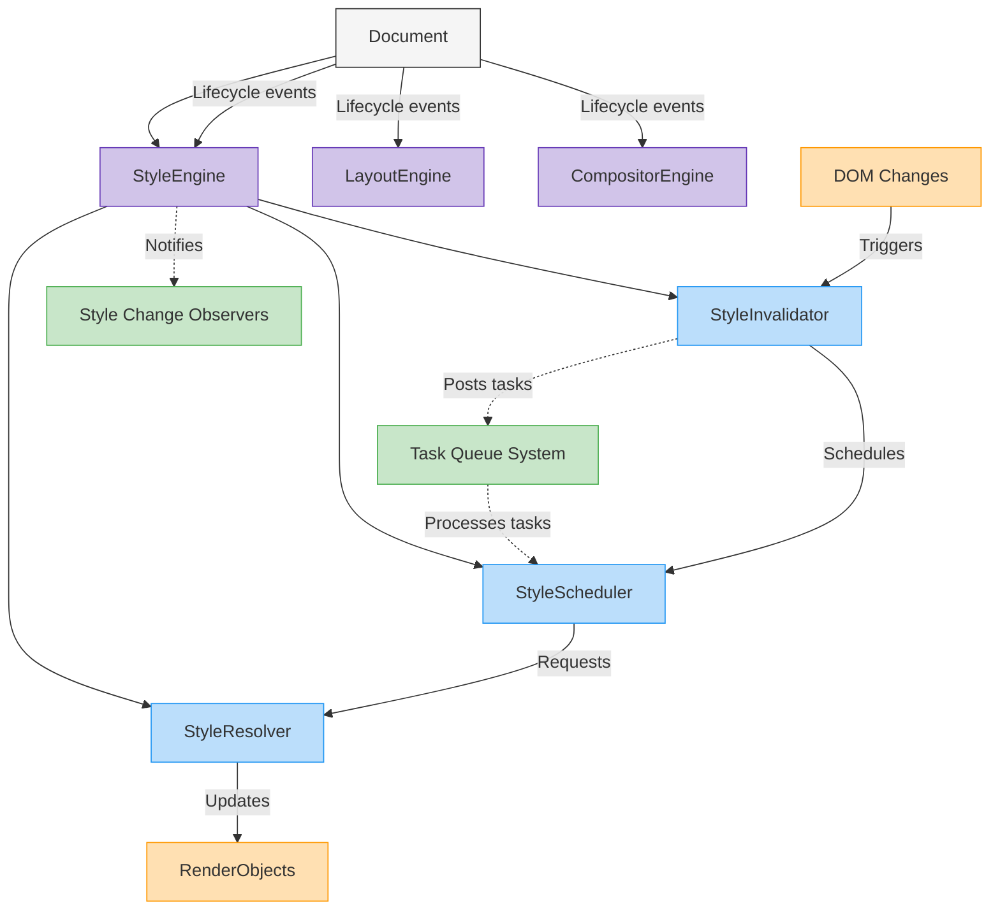

```mermaid
flowchart TD
    %% Ownership Hierarchy
    Document --> StyleEngine
    StyleEngine --> StyleResolver
    StyleEngine --> StyleInvalidator
    StyleEngine --> StyleScheduler
    
    %% Task/Event System
    TaskQueue["Task Queue System"]
    StyleInvalidator -.->|Posts tasks| TaskQueue
    TaskQueue -.->|Processes tasks| StyleScheduler
    
    %% Lifecycle Management
    Document -->|Lifecycle events| StyleEngine
    Document -->|Lifecycle events| LayoutEngine
    Document -->|Lifecycle events| CompositorEngine
    
    %% Observer Pattern
    StyleObservers["Style Change Observers"]
    StyleEngine -.->|Notifies| StyleObservers
    
    %% Unidirectional Flow
    DOM[DOM Changes] -->|Triggers| StyleInvalidator
    StyleInvalidator -->|Schedules| StyleScheduler
    StyleScheduler -->|Requests| StyleResolver
    StyleResolver -->|Updates| RenderObjects
    
    classDef document fill:#f5f5f5,stroke:#333
    classDef engine fill:#d1c4e9,stroke:#673ab7
    classDef component fill:#bbdefb,stroke:#2196f3
    classDef system fill:#c8e6c9,stroke:#4caf50
    classDef flow fill:#ffe0b2,stroke:#ff9800
    
    class Document document
    class StyleEngine,LayoutEngine,CompositorEngine engine
    class StyleResolver,StyleInvalidator,StyleScheduler component
    class TaskQueue system
    class DOM,RenderObjects flow
    class StyleObservers system
```